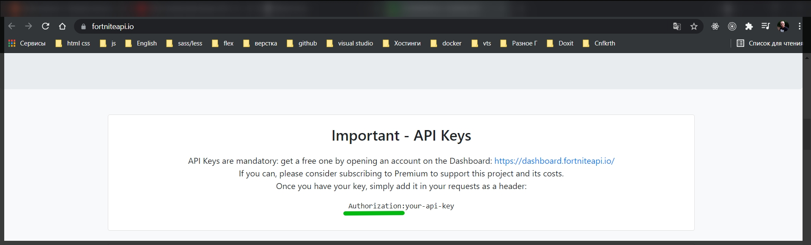
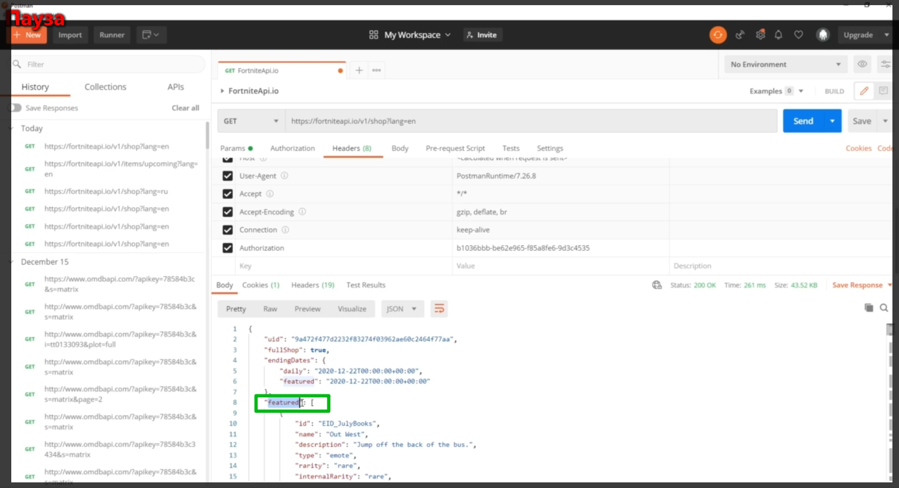
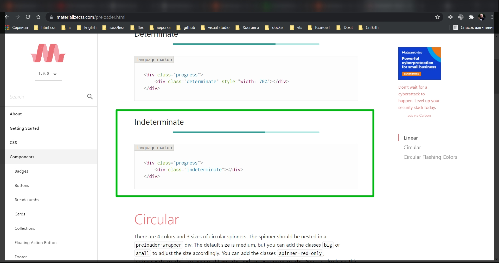
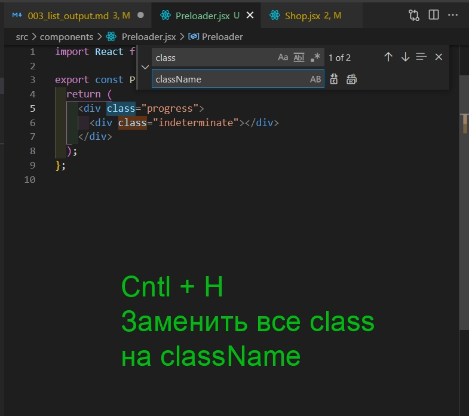
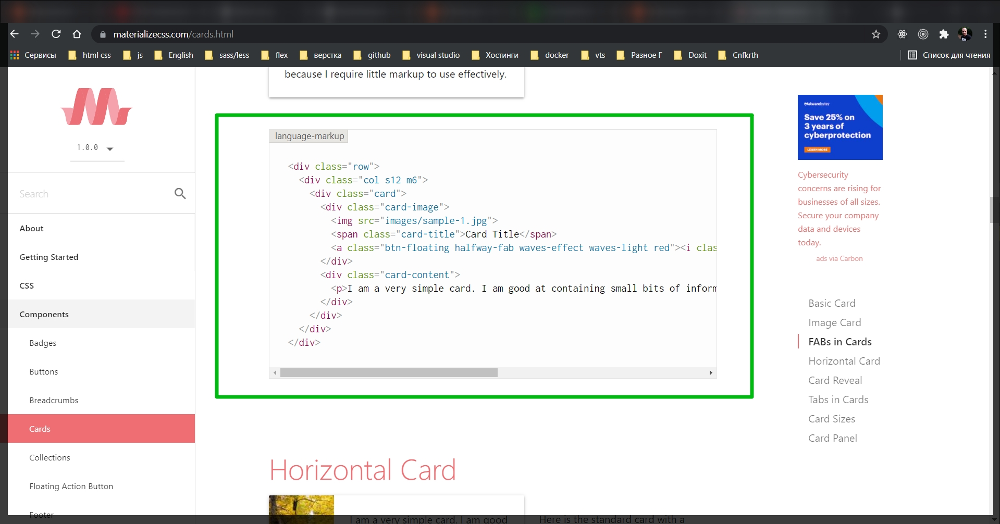
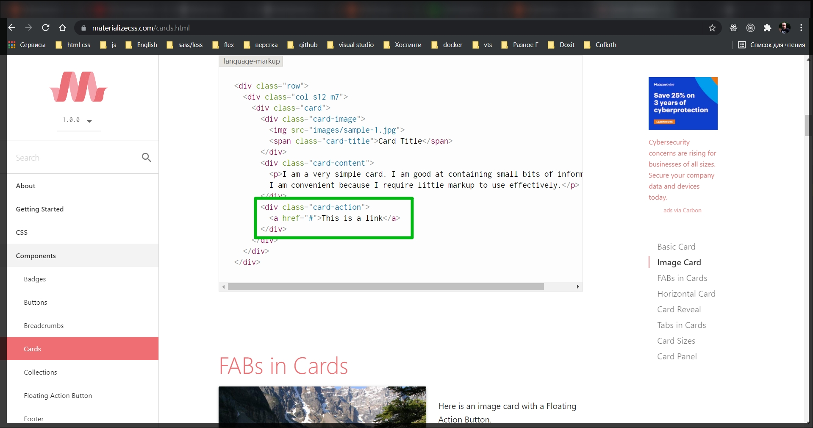
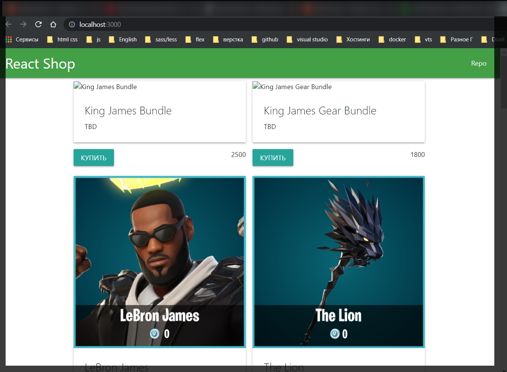
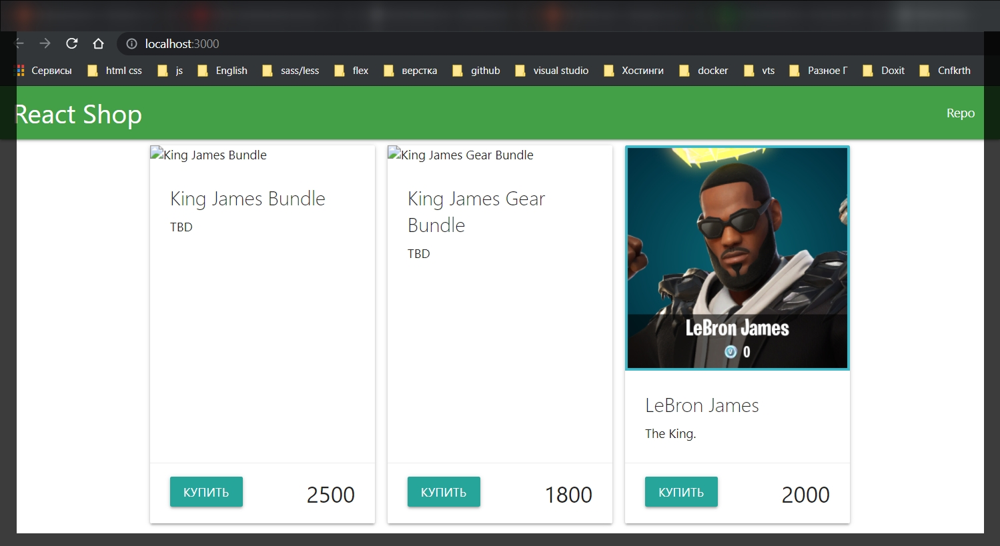

# Вывод списка товаров

Создам список товара с которым мы будем в дальнейшем работать. Нам для этого понадобятся хука. В рамках этого приложения мы все будем делать на хуках.

Для начало импортирую в компонент **Shop** хуки **useState**, **useEffect**.

```jsx
import React, { useState, useEffect } from 'react';

export const Shop = () => {
  return <main className="container content">SHOP</main>;
};
```

Далее указываю список товаров **goods** и функцию обновления этих товаров **setGoods**. Беру их из **useState** который изначально у нас будет пустым массивом.

```jsx
import React, { useState, useEffect } from 'react';

export const Shop = () => {
  const [goods, setGoods] = useState([]);
  return <main className="container content">SHOP</main>;
};
```

Точно так же у нас будет некое состояние загрузки **loading** и **setLoading**.

```jsx
import React, { useState, useEffect } from 'react';

export const Shop = () => {
  const [goods, setGoods] = useState([]);
  const [loading, setLoading] = useState(true);
  return <main className="container content">SHOP</main>;
};
```

Пока что двух данных ключей нам хватит. Пишу **useEffect**.

```jsx
import React, { useState, useEffect } from 'react';

export const Shop = () => {
  const [goods, setGoods] = useState([]);
  const [loading, setLoading] = useState(true);

  useEffect(function getGoods() {}, []);

  return <main className="container content">SHOP</main>;
};
```

Теперь мне нужна ссылка и мой **API** ключ. Соответственно я должен сделать их импорт.

```jsx
import React, { useState, useEffect } from 'react';
import { API_KEY, API_URL } from '../../config';

export const Shop = () => {
  const [goods, setGoods] = useState([]);
  const [loading, setLoading] = useState(true);

  useEffect(function getGoods() {}, []);

  return <main className="container content">SHOP</main>;
};
```

Далее в функции getGoods указываю **fetch** и первым параметром указываю адресс.

```jsx
import React, { useState, useEffect } from 'react';
import { API_KEY, API_URL } from '../../config';

export const Shop = () => {
  const [goods, setGoods] = useState([]);
  const [loading, setLoading] = useState(true);

  useEffect(function getGoods() {
    fetch(API_URL);
  }, []);

  return <main className="container content">SHOP</main>;
};
```

А вот для того что бы передать API_KEY нам нужны заголовки. **Fetch** работает таким образом что у него есть второй пераметр. Первый нужен для **get** запросов т.е. для ссылки. Вторым параметром обычно передают объект. Он нужен для разных вещей. В частности если нам нужно отправить какие-то заголовки. Вот нам сейчас нужно отправить вполне конкретный заголовок. И это внутри нашего объекта ключ с опциями **headers**.

```jsx
import React, { useState, useEffect } from 'react';
import { API_KEY, API_URL } from '../../config';

export const Shop = () => {
  const [goods, setGoods] = useState([]);
  const [loading, setLoading] = useState(true);

  useEffect(function getGoods() {
    fetch(API_URL, {
      headers: {},
    });
  }, []);

  return <main className="container content">SHOP</main>;
};
```

Мы помпним что заголовок который от нас просят это заголовок

```jsx
import React, { useState, useEffect } from 'react';
import { API_KEY, API_URL } from '../../config';

export const Shop = () => {
  const [goods, setGoods] = useState([]);
  const [loading, setLoading] = useState(true);

  useEffect(function getGoods() {
    fetch(API_URL, {
      headers: {},
    });
  }, []);

  return <main className="container content">SHOP</main>;
};
```

И мы помним что заголовок который от нас просят это заголовок



В данном случае заголовок выступает как некий ключ. И как его хначение будет наш **API_KEY**.

```jsx
import React, { useState, useEffect } from 'react';
import { API_KEY, API_URL } from '../config.js';

export const Shop = () => {
  const [goods, setGoods] = useState([]);
  const [loading, setLoading] = useState(true);

  useEffect(function getGoods() {
    fetch(API_URL, {
      headers: {
        Authorization: API_KEY,
      },
    });
  }, []);

  return <main className="container content">SHOP</main>;
};
```

Точно так же по ответу мы должны его обработать т.е. через **then** который принимает **callback** в параметры которого входит **response**. Данный ответ преобразую **response.json**. И после того как у меня будут вполне конкретные данные, еще через **then** пишу еще **callback** который принимает **data**. Эти данные мне нужно передать в функцию **setGoods** т.е. в наши товары.

```jsx
import React, { useState, useEffect } from 'react';
import { API_KEY, API_URL } from '../config.js';

export const Shop = () => {
  const [goods, setGoods] = useState([]);
  const [loading, setLoading] = useState(true);

  useEffect(function getGoods() {
    fetch(API_URL, {
      headers: {
        Authorization: API_KEY,
      },
    })
      .then((response) => response.json())
      .then((data) => {
        setGoods();
      });
  }, []);

  return <main className="container content">SHOP</main>;
};
```

И теперь в **POSTMAN** мне необхобимо посмотреть какой именно ключ мне нужен.



Т.е. я должен вывести не просто **data** а **data.featured**.

Для того что бы запрос ишел туда куда нужно исправил файл **config.js**

```js
//config.js
const API_KEY = process.env.REACT_APP_API_KEY;
const API_URL = `https://fortniteapi.io/v1/shop?lang=en`;

export { API_KEY, API_URL };
```

```jsx
import React, { useState, useEffect } from 'react';
import { API_KEY, API_URL } from '../config.js';

export const Shop = () => {
  const [goods, setGoods] = useState([]);
  const [loading, setLoading] = useState(true);

  useEffect(function getGoods() {
    fetch(API_URL, {
      headers: {
        Authorization: API_KEY,
      },
    })
      .then((response) => response.json())
      .then((data) => {
        setGoods(data.featured);
      });
  }, []);

  return <main className="container content">SHOP</main>;
};
```

При этом имеет смысл проверить что ответ пришел. Потому что если он не пришел, то у нас товары станут **undefined**;

```jsx
import React, { useState, useEffect } from 'react';
import { API_KEY, API_URL } from '../config.js';

export const Shop = () => {
  const [goods, setGoods] = useState([]);
  const [loading, setLoading] = useState(true);

  useEffect(function getGoods() {
    fetch(API_URL, {
      headers: {
        Authorization: API_KEY,
      },
    })
      .then((response) => response.json())
      .then((data) => {
        data.featured && setGoods(data.featured);
      });
  }, []);

  return <main className="container content">SHOP</main>;
};
```

Ну и в любом случае нужно сказать что у нас загрузка закончилась. Для этого указываю функцию **setLoading** в которой выставляю состояние на **false**.

```jsx
import React, { useState, useEffect } from 'react';
import { API_KEY, API_URL } from '../config.js';

export const Shop = () => {
  const [goods, setGoods] = useState([]);
  const [loading, setLoading] = useState(true);

  useEffect(function getGoods() {
    fetch(API_URL, {
      headers: {
        Authorization: API_KEY,
      },
    })
      .then((response) => response.json())
      .then((data) => {
        data.featured && setGoods(data.featured);
        setLoading(false);
      });
  }, []);

  return <main className="container content">SHOP</main>;
};
```

Теперь мне нужен компонент который будет получать список наших товаров. Внутри себя будет подключать еще один компонент с одним элементом товара и т.д. Тоже самое с **Preloader** т.е. предварительный загрузчик.
Разметку беру с **materialize**. Вбиваю в поиск **preloader**.





```jsx
import React from 'react';

export const Preloader = () => {
  return (
    <div className="progress">
      <div className="indeterminate"></div>
    </div>
  );
};
```

Подключаю его в компонент **Shop** и делаю проверку что если у нас идет загрузка, то нужно показать данный компонент. Иначе нет.

```jsx
import React, { useState, useEffect } from 'react';
import { API_KEY, API_URL } from '../config.js';
import { Preloader } from './Preloader.jsx';

export const Shop = () => {
  const [goods, setGoods] = useState([]);
  const [loading, setLoading] = useState(true);

  useEffect(function getGoods() {
    fetch(API_URL, {
      headers: {
        Authorization: API_KEY,
      },
    })
      .then((response) => response.json())
      .then((data) => {
        data.featured && setGoods(data.featured);
        setLoading(false);
      });
  }, []);

  return (
    <main className="container content">{loading ? <Preloader /> : goods}</main>
  );
};
```

Ну и теперь мне нужен компонент для самих товаров.

Создаю компонент **GoodsList**. Данный компонент будет через **props** получать все товары которые по умолчанию будут пустым массивом.

```jsx
import React from 'react';

export const GoodsList = (props) => {
  const { goods = [] } = props;
};
```

Ну и он нам должен возвращать одну карточку товара т.е. некий **GoodsItem**.

```jsx
import React from 'react';

export const GoodsItem = (props) => {
  const {} = props; // деструктурирую
  return <div></div>;
};
```

и так по ключам которые понадобятся смотри в **POSTMAN**.

```jsx
import React from 'react';

export const GoodsItem = (props) => {
  const { id, name, description, price, full_background } = props; // деструктурирую
  return <div></div>;
};
```

И теперь мне нужна карточка куда это все мы будем выводить. Карточку мы опять же возьмем из **materialize**.



```jsx
import React from 'react';

export const GoodsItem = (props) => {
  const { id, name, description, price, full_background } = props; // деструктурирую
  return (
    <div>
      <div className="card">
        <div className="card-image">
          
          <span className="card-title">Card Title</span>
          <a className="btn-floating halfway-fab waves-effect waves-light red">
            <i className="material-icons">add</i>
          </a>
        </div>
        <div className="card-content">
          <p>
            I am a very simple card. I am good at containing small bits of
            information. I am convenient because I require little markup to use
            effectively.
          </p>
        </div>
      </div>
    </div>
  );
};
```

И так же мне нуже **card-action**



И так все почистил и заменил

```jsx
import React from 'react';

export const GoodsItem = (props) => {
  const { id, name, description, price, full_background } = props; // деструктурирую
  return (
    <div>
      <div className="card" id={id}>
        <div className="card-image">
          
          <span className="card-title">{name}</span>
        </div>
        <div className="card-content">
          <p>{description}</p>
        </div>
      </div>
      <div className="card-action">
        <button className="btn">Купить</button>
        <span className="right">{price}</span>
      </div>
    </div>
  );
};
```

Теперь подключаю его в **GoodsList**.

```jsx
import { GoodsItem } from './GoodsItem';

export const GoodsList = (props) => {
  const { goods = [] } = props;
};
```

Теперь по хорошему мне так же нужно сделать проверку

```jsx
import { GoodsItem } from './GoodsItem';

export const GoodsList = (props) => {
  const { goods = [] } = props;

  if (!goods.length) {
    return <h3>Ничего нет</h3>;
  } else {
    return (
      <div className="goods">
        {goods.map((item) => (
          <GoodsItem key={item.id} {...item} />
        ))}
      </div>
    );
  }
};
```

Таким образом я указываю что все полученные данные я деструктурирую и пробрасываю в компонент **GoodsItem**.

Теперь подключаю **GoodsList** к нашему основному приложению. И скажем что когда у нас товар есть я вызываю компонент **GoodsList** передаю ему через prop **goods** существующие товары.

```jsx
import React, { useState, useEffect } from 'react';
import { API_KEY, API_URL } from '../config.js';
import { Preloader } from './Preloader.jsx';
import { GoodsList } from './GoodsList';

export const Shop = () => {
  const [goods, setGoods] = useState([]);
  const [loading, setLoading] = useState(true);

  useEffect(function getGoods() {
    fetch(API_URL, {
      headers: {
        Authorization: API_KEY,
      },
    })
      .then((response) => response.json())
      .then((data) => {
        data.featured && setGoods(data.featured);
        setLoading(false);
      });
  }, []);

  return (
    <main className="container content">
      {loading ? <Preloader /> : <GoodsList goods={goods} />}
    </main>
  );
};
```



Исправил

```jsx
import React from 'react';

export const GoodsItem = (props) => {
  const { id, name, description, price, full_background } = props; // деструктурирую
  return (
    <div className="card" id={id}>
      <div className="card-image">
        
      </div>
      <div className="card-content">
        <span className="card-title">{name}</span>
        <p>{description}</p>
      </div>
      <div className="card-action">
        <button className="btn">Купить</button>
        <span className="right">{price}</span>
      </div>
    </div>
  );
};
```

```jsx
import React from 'react';

export const GoodsItem = (props) => {
  const { id, name, description, price, full_background } = props; // деструктурирую
  return (
    <div className="card" id={id}>
      <div className="card-image">
        
      </div>
      <div className="card-content">
        <span className="card-title">{name}</span>
        <p>{description}</p>
      </div>
      <div className="card-action">
        <button className="btn">Купить</button>
        <span className="price right">{price}</span>
      </div>
    </div>
  );
};
```

```css
body {
  margin: 0;
  font-family: -apple-system, BlinkMacSystemFont, 'Segoe UI', 'Roboto',
    'Oxygen', 'Ubuntu', 'Cantarell', 'Fira Sans', 'Droid Sans',
    'Helvetica Neue', sans-serif;
  -webkit-font-smoothing: antialiased;
  -moz-osx-font-smoothing: grayscale;
}

code {
  font-family: source-code-pro, Menlo, Monaco, Consolas, 'Courier New',
    monospace;
}

nav {
  padding: 0 1rem;
}
.content {
  min-height: calc(100vh - 70px - 60px);
}
.goods {
  display: grid;
  grid-template-columns: repeat(auto-fill, minmax(250px, 1fr));
  gap: 1rem;
}

.card {
  display: flex;
  flex-direction: column;
}
.card-content {
  flex-grow: 1;
  /* С помощью того выровнял карточку как положено */
}
.price {
  font-size: 1.8rem;
}
```


