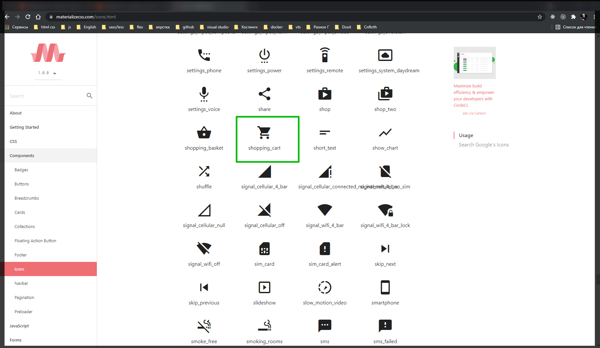
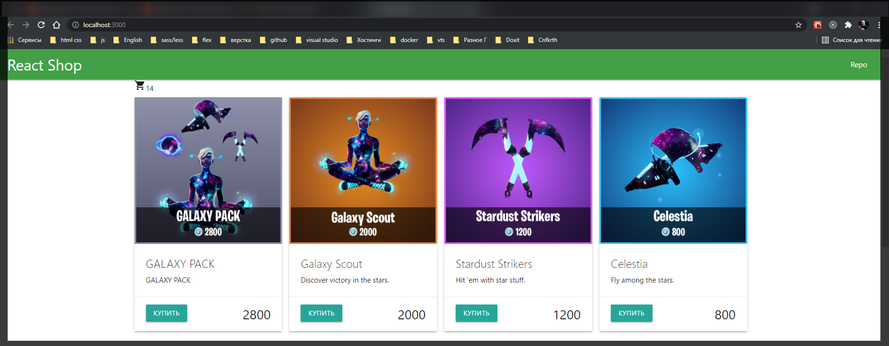
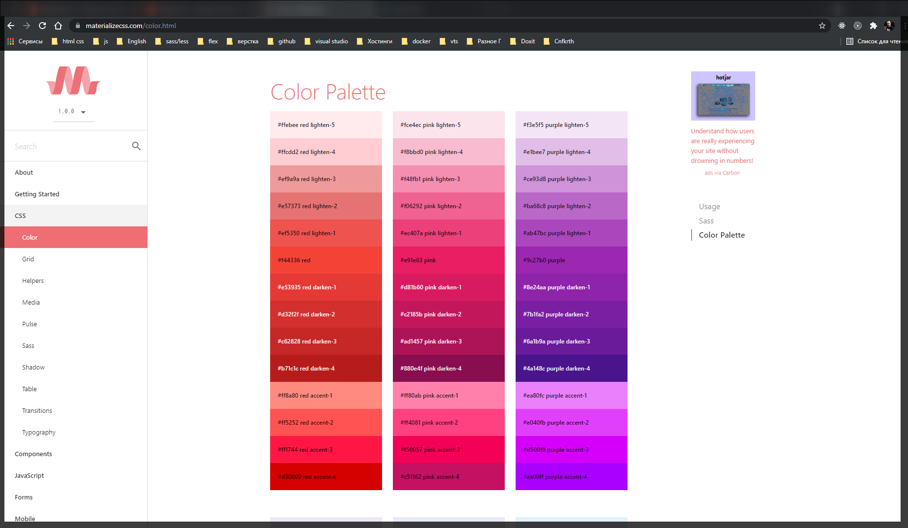
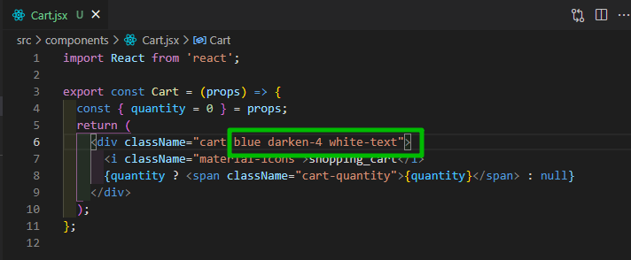
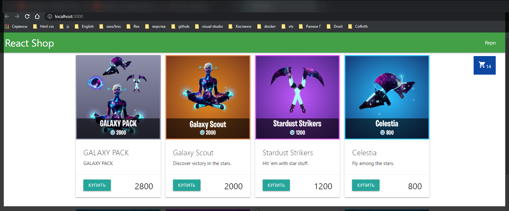
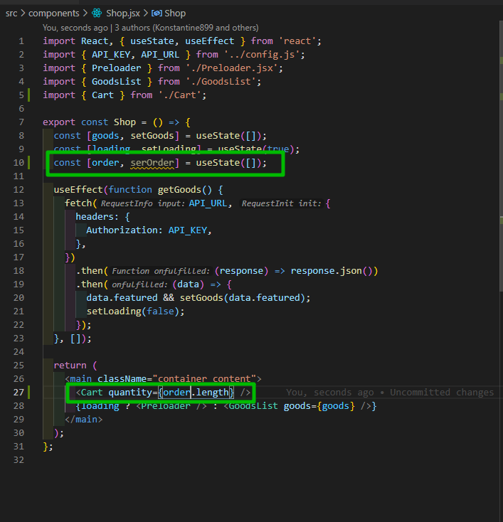
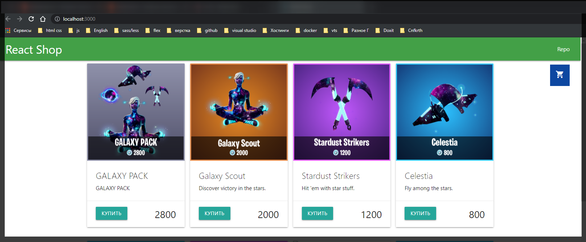

# Состояние заказа, иконка корзины



Выбираю иконку и для этого дела я создаю отдельный компонент. Называю его **Cart** т.е. корзина.

```jsx
import React from 'react';

export const Cart = (props) => {
  return <div></div>;
};
```

Он у нас тоже будет принимать некоторые **props**.

Корзина будет простой. В ней будет информация сколько в ней содержится элементов. И поэтому из пропсов я буду деструктурировать количество т.е. **quantity** со значением по умолчанию **0**.

```jsx
import React from 'react';

export const Cart = (props) => {
  const { quantity = 0 } = props;
  return <div></div>;
};
```

Ну и возвращать я буду соответственно некий **div** внутри которого у нас будет лажать иконка.

```jsx
import React from 'react';

export const Cart = (props) => {
  const { quantity = 0 } = props;
  return (
    <div>
      <i className="material-icons">shopping_cart</i>
    </div>
  );
};
```

В иконке просто надпись без каких либо **JSX** и прочего. И дополнительно к этому я хочу вешать туда информацию о **quantity**. Но мне нужно проверить есть ли оно вообще или нет. Соответственно если оно есть я хочу выдать какую-то разметку.

```jsx
import React from 'react';

export const Cart = (props) => {
  const { quantity = 0 } = props;
  return (
    <div className="cart">
      <i className="material-icons">shopping_cart</i>
      {quantity ? <span className="cart-quantity">{quantity}</span> : null}
    </div>
  );
};
```

Теперь добавляю данный компонент в компонент **Shop**.

```jsx
import React, { useState, useEffect } from 'react';
import { API_KEY, API_URL } from '../config.js';
import { Preloader } from './Preloader.jsx';
import { GoodsList } from './GoodsList';
import { Cart } from './Cart';

export const Shop = () => {
  const [goods, setGoods] = useState([]);
  const [loading, setLoading] = useState(true);

  useEffect(function getGoods() {
    fetch(API_URL, {
      headers: {
        Authorization: API_KEY,
      },
    })
      .then((response) => response.json())
      .then((data) => {
        data.featured && setGoods(data.featured);
        setLoading(false);
      });
  }, []);

  return (
    <main className="container content">
      <Cart quantity={goods.length} />
      {loading ? <Preloader /> : <GoodsList goods={goods} />}
    </main>
  );
};
```

Соответственно **prop quantity={goods.length}** равен длинне наших товаров.



И теперь мне все это дело нужно стилизовать.

```css
body {
  margin: 0;
  font-family: -apple-system, BlinkMacSystemFont, 'Segoe UI', 'Roboto',
    'Oxygen', 'Ubuntu', 'Cantarell', 'Fira Sans', 'Droid Sans',
    'Helvetica Neue', sans-serif;
  -webkit-font-smoothing: antialiased;
  -moz-osx-font-smoothing: grayscale;
}

code {
  font-family: source-code-pro, Menlo, Monaco, Consolas, 'Courier New',
    monospace;
}

nav {
  padding: 0 1rem;
}
.content {
  min-height: calc(100vh - 70px - 60px);
}
.goods {
  display: grid;
  grid-template-columns: repeat(auto-fill, minmax(250px, 1fr));
  gap: 1rem;
}

.card {
  display: flex;
  flex-direction: column;
}
.card-content {
  flex-grow: 1;
  /* С помощью того выровнял карточку как положено */
}
.price {
  font-size: 1.8rem;
}

.cart {
  position: fixed; /*Позиция корзины*/
  bottom: 2rem; /*на маленьком экране*/
  right: 2rem;
  cursor: pointer;
  z-index: 5; /*Делаю так что бы она всегда была по верх других элементов*/
  padding: 1rem;
}
```

И для разукрашивания я могу в **materialize** пойти в раздел **Css** **Color**. И выбрать интересующий цвет.





```jsx
import React from 'react';

export const Cart = (props) => {
  const { quantity = 0 } = props;
  return (
    <div className="cart blue darken-4 white-text">
      <i className="material-icons">shopping_cart</i>
      {quantity ? <span className="cart-quantity">{quantity}</span> : null}
    </div>
  );
};
```

И теперь мне нужно написать медиа запрос.

```css
body {
  margin: 0;
  font-family: -apple-system, BlinkMacSystemFont, 'Segoe UI', 'Roboto',
    'Oxygen', 'Ubuntu', 'Cantarell', 'Fira Sans', 'Droid Sans',
    'Helvetica Neue', sans-serif;
  -webkit-font-smoothing: antialiased;
  -moz-osx-font-smoothing: grayscale;
}

code {
  font-family: source-code-pro, Menlo, Monaco, Consolas, 'Courier New',
    monospace;
}

nav {
  padding: 0 1rem;
}
.content {
  min-height: calc(100vh - 70px - 60px);
}
.goods {
  display: grid;
  grid-template-columns: repeat(auto-fill, minmax(250px, 1fr));
  gap: 1rem;
}

.card {
  display: flex;
  flex-direction: column;
}
.card-content {
  flex-grow: 1;
  /* С помощью того выровнял карточку как положено */
}
.price {
  font-size: 1.8rem;
}

.cart {
  position: fixed; /*Позиция корзины*/
  bottom: 2rem; /*на маленьком экране*/
  right: 2rem;
  cursor: pointer;
  z-index: 5; /*Делаю так что бы она всегда была по верх других элементов*/
  padding: 1rem;
}

@media (min-width: 767px) {
  .cart {
    top: 5rem;
    bottom: unset;
  }
}
```



Если обратим внимание то у меня в корзине как буд-то лежит **14** товаров. Вероятно это попадает из **goods**.

Для этого в нашем магазине понадобится сделать еще одно состояние. Оно изначально будет у нас массивом.



```jsx
import React, { useState, useEffect } from 'react';
import { API_KEY, API_URL } from '../config.js';
import { Preloader } from './Preloader.jsx';
import { GoodsList } from './GoodsList';
import { Cart } from './Cart';

export const Shop = () => {
  const [goods, setGoods] = useState([]);
  const [loading, setLoading] = useState(true);
  const [order, serOrder] = useState([]);

  useEffect(function getGoods() {
    fetch(API_URL, {
      headers: {
        Authorization: API_KEY,
      },
    })
      .then((response) => response.json())
      .then((data) => {
        data.featured && setGoods(data.featured);
        setLoading(false);
      });
  }, []);

  return (
    <main className="container content">
      <Cart quantity={order.length} />
      {loading ? <Preloader /> : <GoodsList goods={goods} />}
    </main>
  );
};
```


