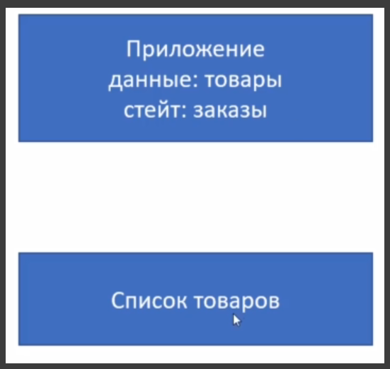
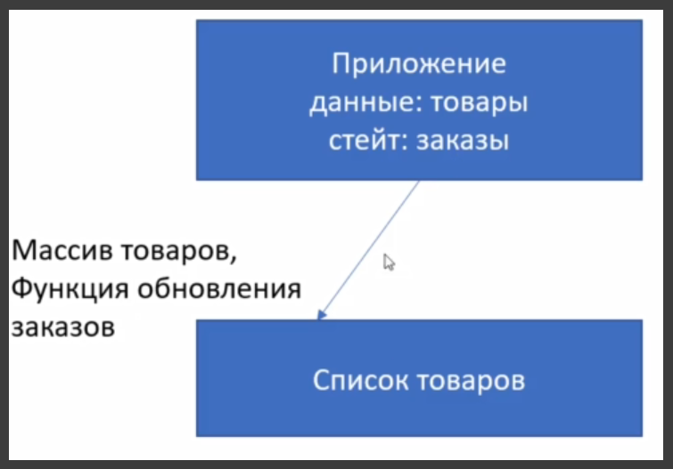
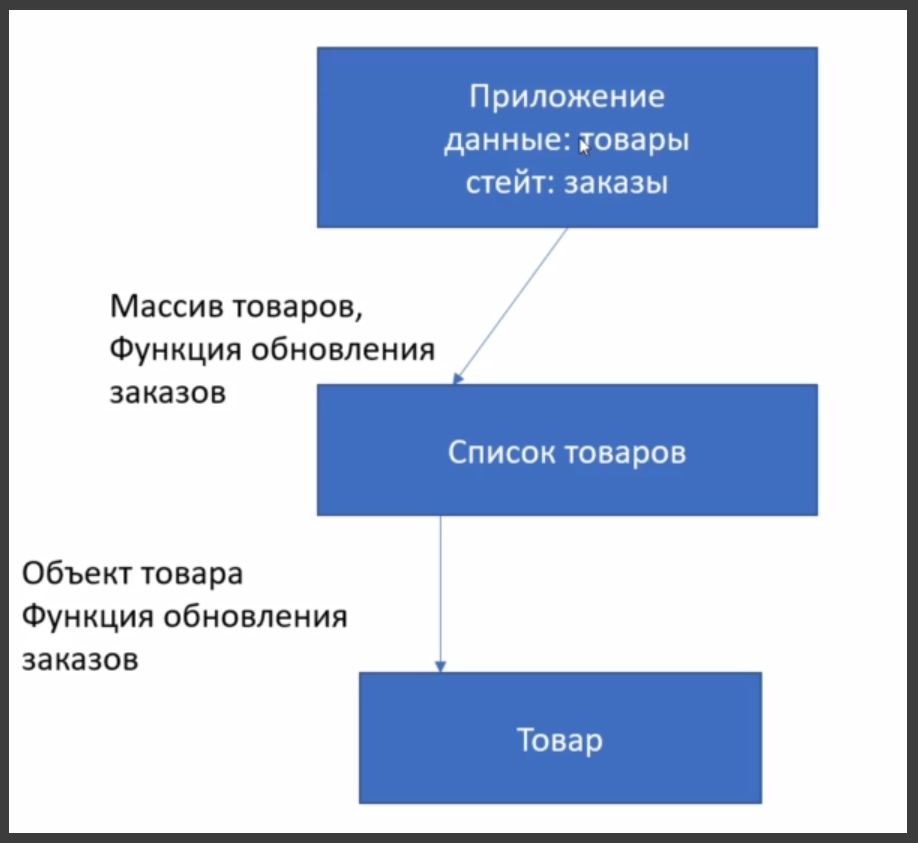
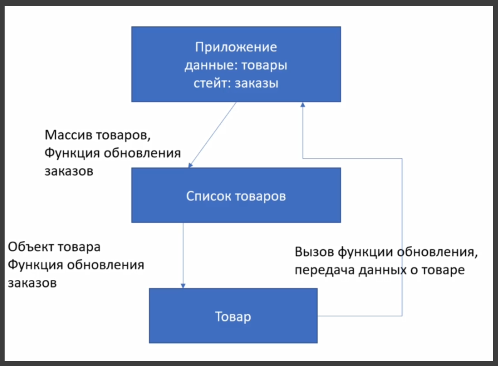
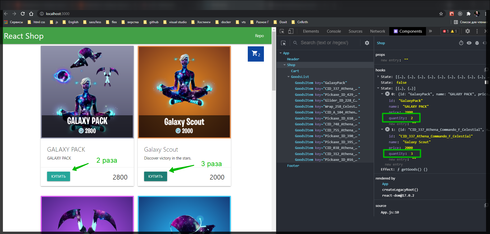

# Решение функция добавления товара в заказ

И так определимся с тем что мы делаем. У нас есть уровень нашего магазина, наше приложение.


У него есть информация о товарах. В данном случае он у нас как некий **state** храниться. Но это все равно некие статические данные которые мы получили из вне. И в данном конкретном случае не плпнируем обновлять этот список.

У нас есть состояние заказа которое как раз таки будет динамическим.



Что мы делаем сейчас? У нас есть список товаров. Мы в этот список товаров должны спустить не только список товаров который спускаем сейчас. Но и некую функцию обновления заказов.



Соответственно из списка товаров мы для каждого элемента товаров отрисовываем карточку товара сколько бы там товаров не было. При этом спускаем сюда информацию одного конкретного товара. Плюс ту же самую функцию обновления заказов которую мы должны создать на уровне приложения что бы менять **state** заказов.



И тогда каждая карточка должна обладать функциональностью что бы к примеру при нажатии на кнопку купить, у нас вызывается эта функция созданная на уровне приложения. И вызов на нижнем уровне приводит к тому что у нас на верхний уровень передается вполне конкретная информация о товаре. И этот товар у нас добавляется непосредственно в сам заказ.



Это то что нудно сделать на данном этапе.

Пишу функцию на уровне нашего магазина т.е. в компоненте **Shop**. И называю данную функцию **addToBasket**. Я ожидаю что данная функция будет принимать один элемент товара некий **item**. В **item** у меня скорее всего будет **id**, **name**, **price**. Этого вполне достаточно, но в самой корзине мне нужно еще знать о количестве.

По-этому первым делом мне нужно проверить есть ли в моем **state** заказа данный товар или нет. Для того что бы соответственно не создавать новый.

Для начало сделаю простейший вариант. У меня есть функция **setOrder** которую я помещаю в **addToBascket**. Функция **setOrder** всегда должна возвращать массив. И она естественно возвращает список который у нас уже лежит в массиве **...order**, и добавляет туда новый объект **item**.

```jsx
import React, { useState, useEffect } from 'react';
import { API_KEY, API_URL } from '../config.js';
import { Preloader } from './Preloader.jsx';
import { GoodsList } from './GoodsList';
import { Cart } from './Cart';

export const Shop = () => {
  const [goods, setGoods] = useState([]);
  const [loading, setLoading] = useState(true);
  const [order, setOrder] = useState([]);

  const addToBasket = (item) => {
    setOrder([...order, item]);
  };

  useEffect(function getGoods() {
    fetch(API_URL, {
      headers: {
        Authorization: API_KEY,
      },
    })
      .then((response) => response.json())
      .then((data) => {
        data.featured && setGoods(data.featured);
        setLoading(false);
      });
  }, []);

  return (
    <main className="container content">
      <Cart quantity={order.length} />
      {loading ? <Preloader /> : <GoodsList goods={goods} />}
    </main>
  );
};
```

Но по сути в этом **item** у нас сейчас нет информации о количестве. По-этому мы должны создать что-нибудь вроде **newItem**. Это будет объект который унаследует все ключи от нашего **...item**, которые мы получим через функцию, и добавим одно поле **quantity** со значением **1**. И теперь добавлять в наш заказ будем не просто **item** а **newItem**.

```jsx
import React, { useState, useEffect } from 'react';
import { API_KEY, API_URL } from '../config.js';
import { Preloader } from './Preloader.jsx';
import { GoodsList } from './GoodsList';
import { Cart } from './Cart';

export const Shop = () => {
  const [goods, setGoods] = useState([]);
  const [loading, setLoading] = useState(true);
  const [order, setOrder] = useState([]);

  const addToBasket = (item) => {
    const newItem = {
      ...item,
      quantity: 1,
    };
    setOrder([...order, newItem]);
  };

  useEffect(function getGoods() {
    fetch(API_URL, {
      headers: {
        Authorization: API_KEY,
      },
    })
      .then((response) => response.json())
      .then((data) => {
        data.featured && setGoods(data.featured);
        setLoading(false);
      });
  }, []);

  return (
    <main className="container content">
      <Cart quantity={order.length} />
      {loading ? <Preloader /> : <GoodsList goods={goods} />}
    </main>
  );
};
```

Это тот сценарий когда у нас товар добавляется первый раз. В том случае соответственно если он не добавлялся.

Но нам нужно сделать некую проверку для того что бы **quantity** нарасчивать.

У меня будет некий проверочный индекс к примеру **itemIndex** и мы будем обходить наш список заказов методом **findIndex** т.е. **order.findIndex()**. Работает он следующим образом. Он у нас принимает функцию которая обходит каждый элемент. Соответственно я буду обходить каждый **orderItem** т.е. элемент заказа. И я буду сравнивать **orderItem** с его индификатором **orderItem.id** c тем индификатором который я получу снаружи. Соответственно у этого item который мы добавляем тоже должен приходить ключик с **id** т.е. **item.id**. Если у нас ключик найдется, то мы просто получим индекс этого массива. Если не найдем, то мы получим **-1** т.е. так работает **findIndex**. Поэтому в дальнейшем мне нужно сделать проверку что если наш **itemIndex < 0**, то мы идем по такой логике. Т.е. если мы добавляем элемент первый раз

```jsx
import React, { useState, useEffect } from 'react';
import { API_KEY, API_URL } from '../config.js';
import { Preloader } from './Preloader.jsx';
import { GoodsList } from './GoodsList';
import { Cart } from './Cart';

export const Shop = () => {
  const [goods, setGoods] = useState([]);
  const [loading, setLoading] = useState(true);
  const [order, setOrder] = useState([]);

  const addToBasket = (item) => {
    const itemIndex = order.findIndex((orderItem) => orderItem.id === item.id);
    if (itemIndex < 0) {
      const newItem = {
        ...item,
        quantity: 1,
      };
      setOrder([...order, newItem]);
    }
  };

  useEffect(function getGoods() {
    fetch(API_URL, {
      headers: {
        Authorization: API_KEY,
      },
    })
      .then((response) => response.json())
      .then((data) => {
        data.featured && setGoods(data.featured);
        setLoading(false);
      });
  }, []);

  return (
    <main className="container content">
      <Cart quantity={order.length} />
      {loading ? <Preloader /> : <GoodsList goods={goods} />}
    </main>
  );
};
```

Если **itemIndex === 0**, то мы соответственно немного меняем нашу логику. Нам тогда нужно найти соответствующий элемент. Добавить **quantity** т.е. изменить его значение. Но все остальное оставить без изменения. Т.е. все равно нужно перебрать наш массив.

Точно так же в блоке **else** создаю новую переменную которая будет называться новый заказ **newOrder**. Беру общий заказ **order** и перебираю его с помощь **map**. На каждом шаге я получаю некий **orderItem** и его **index**. И вот **index** как раз нам пригодится.

```jsx
import React, { useState, useEffect } from 'react';
import { API_KEY, API_URL } from '../config.js';
import { Preloader } from './Preloader.jsx';
import { GoodsList } from './GoodsList';
import { Cart } from './Cart';

export const Shop = () => {
  const [goods, setGoods] = useState([]);
  const [loading, setLoading] = useState(true);
  const [order, setOrder] = useState([]);

  const addToBasket = (item) => {
    const itemIndex = order.findIndex((orderItem) => orderItem.id === item.id);
    if (itemIndex < 0) {
      const newItem = {
        ...item,
        quantity: 1,
      };
      setOrder([...order, newItem]);
    } else {
      const newOrder = order.map((orderItem, index) => {});
    }
  };

  useEffect(function getGoods() {
    fetch(API_URL, {
      headers: {
        Authorization: API_KEY,
      },
    })
      .then((response) => response.json())
      .then((data) => {
        data.featured && setGoods(data.featured);
        setLoading(false);
      });
  }, []);

  return (
    <main className="container content">
      <Cart quantity={order.length} />
      {loading ? <Preloader /> : <GoodsList goods={goods} />}
    </main>
  );
};
```

И внутри мы будем проверять что если этот **index === indexItem** который мы нашли, то у нас будет один вариант и соответственно если не равен то другой.

```jsx
import React, { useState, useEffect } from 'react';
import { API_KEY, API_URL } from '../config.js';
import { Preloader } from './Preloader.jsx';
import { GoodsList } from './GoodsList';
import { Cart } from './Cart';

export const Shop = () => {
  const [goods, setGoods] = useState([]);
  const [loading, setLoading] = useState(true);
  const [order, setOrder] = useState([]);

  const addToBasket = (item) => {
    const itemIndex = order.findIndex((orderItem) => orderItem.id === item.id);
    if (itemIndex < 0) {
      const newItem = {
        ...item,
        quantity: 1,
      };
      setOrder([...order, newItem]);
    } else {
      const newOrder = order.map((orderItem, index) => {
        if (index === itemIndex) {
        } else {
          return orderItem;
        }
      });
    }
  };

  useEffect(function getGoods() {
    fetch(API_URL, {
      headers: {
        Authorization: API_KEY,
      },
    })
      .then((response) => response.json())
      .then((data) => {
        data.featured && setGoods(data.featured);
        setLoading(false);
      });
  }, []);

  return (
    <main className="container content">
      <Cart quantity={order.length} />
      {loading ? <Preloader /> : <GoodsList goods={goods} />}
    </main>
  );
};
```

Соответственно если мы допустим нашли **index 1**. **itemIndex === 1**. Мы обходим все элементы массива. Нашли первый элемен массива и его точечно меняем. Если это не первы элемент массива то мы его возвращаем так как он и был.

Я возвращаю объект в который входит **...orderItem** со всеми своими ключами не изменными остаются, но один ключик который называется **quantity** мы должны изменить. соответственно я беру **orderItem.quantity + 1**.

```jsx
import React, { useState, useEffect } from 'react';
import { API_KEY, API_URL } from '../config.js';
import { Preloader } from './Preloader.jsx';
import { GoodsList } from './GoodsList';
import { Cart } from './Cart';

export const Shop = () => {
  const [goods, setGoods] = useState([]);
  const [loading, setLoading] = useState(true);
  const [order, setOrder] = useState([]);

  const addToBasket = (item) => {
    const itemIndex = order.findIndex((orderItem) => orderItem.id === item.id);
    if (itemIndex < 0) {
      const newItem = {
        ...item,
        quantity: 1,
      };
      setOrder([...order, newItem]);
    } else {
      const newOrder = order.map((orderItem, index) => {
        if (index === itemIndex) {
          return {
            ...orderItem,
            quantity: orderItem.quantity + 1,
          };
        } else {
          return orderItem;
        }
      });
    }
  };

  useEffect(function getGoods() {
    fetch(API_URL, {
      headers: {
        Authorization: API_KEY,
      },
    })
      .then((response) => response.json())
      .then((data) => {
        data.featured && setGoods(data.featured);
        setLoading(false);
      });
  }, []);

  return (
    <main className="container content">
      <Cart quantity={order.length} />
      {loading ? <Preloader /> : <GoodsList goods={goods} />}
    </main>
  );
};
```

После чего у нас формируется новый массив **newOrder**. И этот новый массив мы через метов **setOrder** отправляем в наш **state**.

```jsx
import React, { useState, useEffect } from 'react';
import { API_KEY, API_URL } from '../config.js';
import { Preloader } from './Preloader.jsx';
import { GoodsList } from './GoodsList';
import { Cart } from './Cart';

export const Shop = () => {
  const [goods, setGoods] = useState([]);
  const [loading, setLoading] = useState(true);
  const [order, setOrder] = useState([]);

  const addToBasket = (item) => {
    const itemIndex = order.findIndex((orderItem) => orderItem.id === item.id);
    if (itemIndex < 0) {
      const newItem = {
        ...item,
        quantity: 1,
      };
      setOrder([...order, newItem]);
    } else {
      const newOrder = order.map((orderItem, index) => {
        if (index === itemIndex) {
          return {
            ...orderItem,
            quantity: orderItem.quantity + 1,
          };
        } else {
          return orderItem;
        }
      });
      setOrder(newOrder);
    }
  };

  useEffect(function getGoods() {
    fetch(API_URL, {
      headers: {
        Authorization: API_KEY,
      },
    })
      .then((response) => response.json())
      .then((data) => {
        data.featured && setGoods(data.featured);
        setLoading(false);
      });
  }, []);

  return (
    <main className="container content">
      <Cart quantity={order.length} />
      {loading ? <Preloader /> : <GoodsList goods={goods} />}
    </main>
  );
};
```

В данном случае в **Card** у нас просто приходит количество **quantity**.

Теперь функцию **addToBasket** спускаем в общий список компонента **GoodsList**.

```jsx
import React, { useState, useEffect } from 'react';
import { API_KEY, API_URL } from '../config.js';
import { Preloader } from './Preloader.jsx';
import { GoodsList } from './GoodsList';
import { Cart } from './Cart';

export const Shop = () => {
  const [goods, setGoods] = useState([]);
  const [loading, setLoading] = useState(true);
  const [order, setOrder] = useState([]);

  const addToBasket = (item) => {
    const itemIndex = order.findIndex((orderItem) => orderItem.id === item.id);
    if (itemIndex < 0) {
      const newItem = {
        ...item,
        quantity: 1,
      };
      setOrder([...order, newItem]);
    } else {
      const newOrder = order.map((orderItem, index) => {
        if (index === itemIndex) {
          return {
            ...orderItem,
            quantity: orderItem.quantity + 1,
          };
        } else {
          return orderItem;
        }
      });
      setOrder(newOrder);
    }
  };

  useEffect(function getGoods() {
    fetch(API_URL, {
      headers: {
        Authorization: API_KEY,
      },
    })
      .then((response) => response.json())
      .then((data) => {
        data.featured && setGoods(data.featured);
        setLoading(false);
      });
  }, []);

  return (
    <main className="container content">
      <Cart quantity={order.length} />
      {loading ? (
        <Preloader />
      ) : (
        <GoodsList goods={goods} addToBasket={addToBasket} />
      )}
    </main>
  );
};
```

В **GoodsList** мы должны данную функцию поймать. Для того что бы ничего не сломать на всякий случай говорю что данная функция по умолчанию будет **Function.prototype**. И далее передаю ее еще раз.

```jsx
import { GoodsItem } from './GoodsItem';

export const GoodsList = (props) => {
  const { goods = [], addToBasket = Function.prototype } = props;

  if (!goods.length) {
    return <h3>Ничего нет</h3>;
  } else {
    return (
      <div className="goods">
        {goods.map((item) => (
          <GoodsItem key={item.id} {...item} addToBasket={addToBasket} />
        ))}
      </div>
    );
  }
};
```

В **GoodsItem** тоже ее развернем и вешаю данную функцию на кнопку в вызов которой передаю следующие вещи. **id**, **name**, **price**.

```jsx
import React from 'react';

export const GoodsItem = (props) => {
  const {
    id,
    name,
    description,
    price,
    full_background,
    addToBasket = Function.prototype,
  } = props; // деструктурирую
  return (
    <div className="card" id={id}>
      <div className="card-image">
        
      </div>
      <div className="card-content">
        <span className="card-title">{name}</span>
        <p>{description}</p>
      </div>
      <div className="card-action">
        <button
          className="btn"
          onClick={() => addToBasket({ id, name, price })}
        >
          Купить
        </button>
        <span className="price right">{price}</span>
      </div>
    </div>
  );
};
```


