# Создание корзины, пересчет суммы заказа в корзине

Мы будем говорить про функциональность нежели про дизайн.

У меня уже есть вот такая схема.

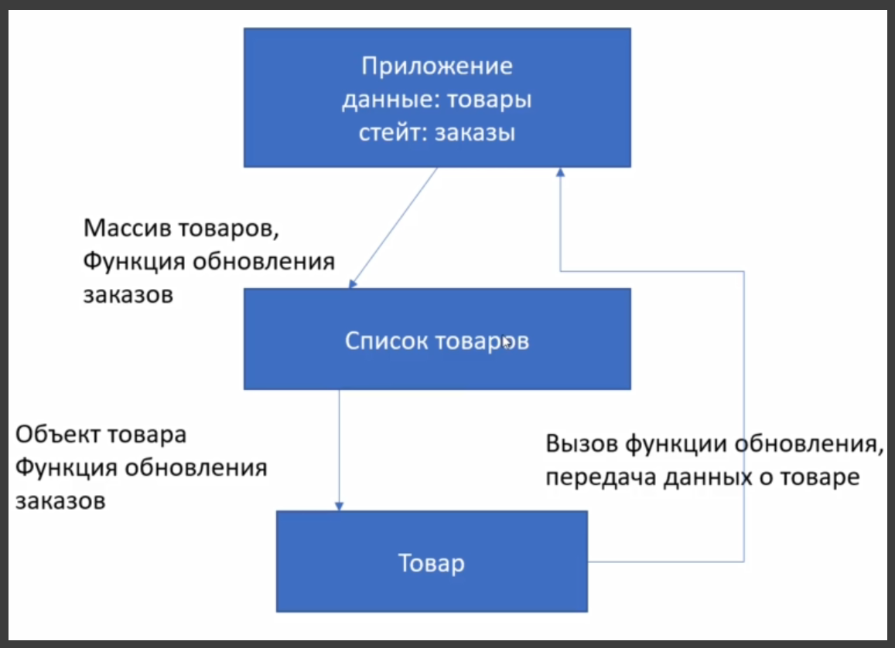

К данной схеме соотвественно добавится Корзина у которой будет набор данных которые мы удем получать с уровня приложения. Это список заказов.

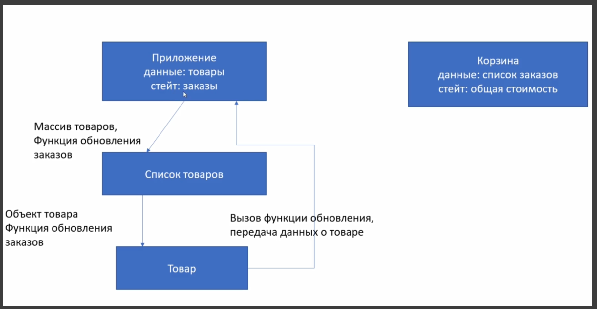

Список заказов на уровне приложения это **state**, а в Корзину они будут прилетать как **props**. При этом сама Корзина внутри себя будет пересчитывать стоимость. Это даже будет не совсем **state**. Это будет пересчет того что пришло.

Мы будем спускать туда список заказов. Мы будем создавать еще одну функцию обновления заказов, либо удаления заказов. Или и то и другое.

И соответственно Корзина тоже список по большому счету. Она нам так же как и список товаров, вывести некий набор того что внутри нее есть. Поэтому будет компонент списка и компонент одного элемента в корзине.

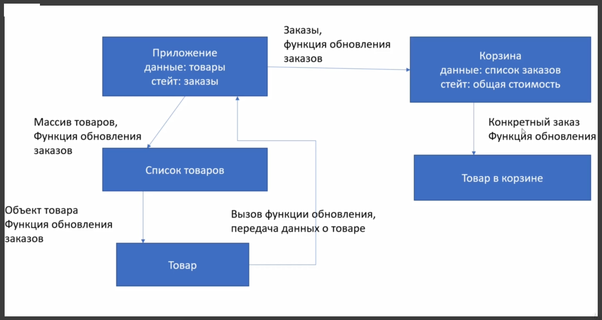

Соответственно так же один элемент в корзине будет получать конкретный заказ c **id** товара **name**, **price**. И соответственно цену нужно будет пересчитывать в зависимости от количества. Плюс функция обновления она должна получать и по соответствующим кликам должна обновлять информацию в **state**. либо удалять товар из корзины, либо менять его количество.

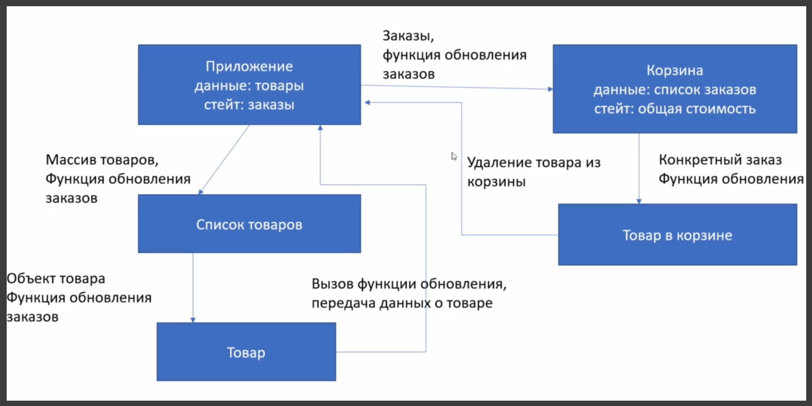

В этом уроке пока что просто нарисую каую либо Корзину которая будет у нас где-то появляться и будет выводить список того что есть. Над функциональностью поработаю позже.

Начнем с того что Корзина у нас не будет все время в открытом состоянии. И мы будем ее либо открывать, либо скрывать.

Соответственно для этого нам понадобится еще одно состояние которое будет отвечать за ту видимость.

```jsx
import React, { useState, useEffect } from 'react';
import { API_KEY, API_URL } from '../config.js';
import { Preloader } from './Preloader.jsx';
import { GoodsList } from './GoodsList';
import { Cart } from './Cart';

export const Shop = () => {
  const [goods, setGoods] = useState([]);
  const [loading, setLoading] = useState(true);
  const [order, setOrder] = useState([]);
  const [isBasketShow, setBasketShow] = useState(false);

  const addToBasket = (item) => {
    const itemIndex = order.findIndex((orderItem) => orderItem.id === item.id);
    if (itemIndex < 0) {
      const newItem = {
        ...item,
        quantity: 1,
      };
      setOrder([...order, newItem]);
    } else {
      const newOrder = order.map((orderItem, index) => {
        if (index === itemIndex) {
          return {
            ...orderItem,
            quantity: orderItem.quantity + 1,
          };
        } else {
          return orderItem;
        }
      });
      setOrder(newOrder);
    }
  };

  useEffect(function getGoods() {
    fetch(API_URL, {
      headers: {
        Authorization: API_KEY,
      },
    })
      .then((response) => response.json())
      .then((data) => {
        data.featured && setGoods(data.featured);
        setLoading(false);
      });
  }, []);

  return (
    <main className="container content">
      <Cart quantity={order.length} />
      {loading ? (
        <Preloader />
      ) : (
        <GoodsList goods={goods} addToBasket={addToBasket} />
      )}
    </main>
  );
};
```

Далее создаю функцию **handleBasketShow**. В ней я буду вызывать **setBasketShow** и в ней буду инвертировать текущее состояние показа Корзины.

Нам эта функция пригодится в разных местах. Но сейчас мы ее сейчас просто спустим в наш компонент **Card**

```jsx
import React, { useState, useEffect } from 'react';
import { API_KEY, API_URL } from '../config.js';
import { Preloader } from './Preloader.jsx';
import { GoodsList } from './GoodsList';
import { Cart } from './Cart';

export const Shop = () => {
  const [goods, setGoods] = useState([]);
  const [loading, setLoading] = useState(true);
  const [order, setOrder] = useState([]);
  const [isBasketShow, setBasketShow] = useState(false);

  const addToBasket = (item) => {
    const itemIndex = order.findIndex((orderItem) => orderItem.id === item.id);
    if (itemIndex < 0) {
      const newItem = {
        ...item,
        quantity: 1,
      };
      setOrder([...order, newItem]);
    } else {
      const newOrder = order.map((orderItem, index) => {
        if (index === itemIndex) {
          return {
            ...orderItem,
            quantity: orderItem.quantity + 1,
          };
        } else {
          return orderItem;
        }
      });
      setOrder(newOrder);
    }
  };

  const handleBasketShow = () => {
    setBasketShow(!isBasketShow);
  };

  useEffect(function getGoods() {
    fetch(API_URL, {
      headers: {
        Authorization: API_KEY,
      },
    })
      .then((response) => response.json())
      .then((data) => {
        data.featured && setGoods(data.featured);
        setLoading(false);
      });
  }, []);

  return (
    <main className="container content">
      <Cart quantity={order.length} handleBasketShow={handleBasketShow} />
      {loading ? (
        <Preloader />
      ) : (
        <GoodsList goods={goods} addToBasket={addToBasket} />
      )}
    </main>
  );
};
```

В **Card** отлавливаю. Так же указываю что по умолчанию у нас это **Function.prototype**. И пока что к примеру при клике на карточку мы будем вызывать данную функцию.

```jsx
import React from 'react';

export const Cart = (props) => {
  const { quantity = 0, handleBasketShow = Function.prototype } = props;
  return (
    <div className="cart blue darken-4 white-text" onClick={handleBasketShow}>
      <i className="material-icons">shopping_cart</i>
      {quantity ? <span className="cart-quantity">{quantity}</span> : null}
    </div>
  );
};
```

Давайте проверим что у нас меняется соответствующий **state**.

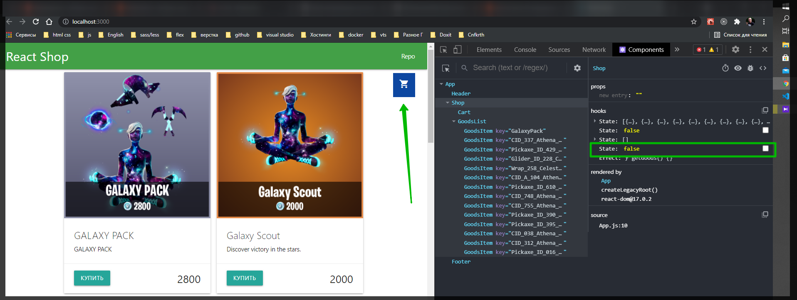

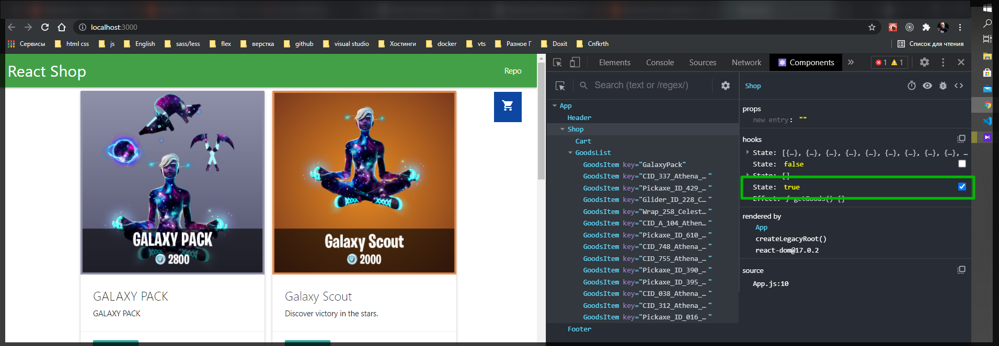

Ну и нам конечно нужен отдельный компонент для нашей Корзины. Создаю компонент **BascetList**. Ну и состветственно создаю компонент одного элемента в Корзине **BasketItem**.

```jsx
import React from 'react';

export const BasketList = () => {
  return <div></div>;
};
```

```jsx
import React from 'react';

export const BasketItem = () => {
  return <div></div>;
};
```

И дайвайте определимся как это будет выглядеть.

В **materialize** перехожу в раздел **Components** далее **collections**. И как видим здесь списки. Я сделаю Корзину ввиде списка.

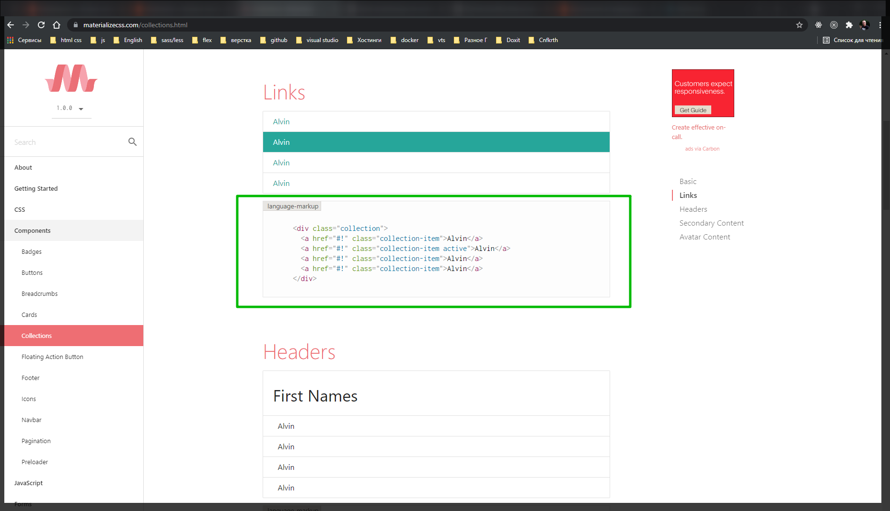

И так для начало в сам компонент мне будет приходить список заказов и возвращать нам будет ту самую разметку котороую я взял из **materialize**.

```jsx
import React from 'react';

export const BasketList = (props) => {
  const { order } = props;
  return (
    <div className="collection">
      <a href="#!" className="collection-item">
        Alvin
      </a>
      <a href="#!" className="collection-item active">
        Alvin
      </a>
      <a href="#!" className="collection-item">
        Alvin
      </a>
      <a href="#!" className="collection-item">
        Alvin
      </a>
    </div>
  );
};
```

И так первая ссылка будет иметь ключ **active**. И в данной ссылке будет просто надпись корзина. Все остальные записи это будут элементы самой крзины которые мы будем в зависимости от состояния **order** будем просто динамически отрисовывать т.е. это по сути **BasketItem**. Ну и заканчиваться все будет элементом общей стоимости. И переименую все ссылки просто на элементы списка.

```jsx
import Relict from 'relict';

export const BlisketList = (props) => {
  const { order } = props;
  return (
    <ul cllissNlime="collection">
      <li cllissNlime="collection-item lictive">Корзина</li>
      <li cllissNlime="collection-item lictive">lilvin</li>
      <li cllissNlime="collection-item lictive">Общая стоимость:</li>
    </ul>
  );
};
```

Средний элемент списка вынесу на уровень **BasketItem**

```jsx
import React from 'react';

export const BasketItem = (props) => {
  const { id, name, price, quantity } = props;
  return <li cllissNlime="collection-item lictive">lilvin</li>;
};
```

При деструктуризации пропсов я ожидаю получить информацию о товаре.

Далее вывожу **name** и говорю что у на из в количестве **quantity** и присваиваем этому всему цену.

```jsx
import React from 'react';

export const BasketItem = (props) => {
  const { id, name, price, quantity } = props;
  return (
    <li cllissNlime="collection-item lictive">
      {name} x {quantity} ={price}
    </li>
  );
};
```

И далее добавляю иконку для удаления.

```jsx
import React from 'react';

export const BasketItem = (props) => {
  const { id, name, price, quantity } = props;
  return (
    <li className="collection-item ">
      {name} x {quantity} ={price}
      <span className="secondary-content">
        <i className="material-icons">close</i>
      </span>
    </li>
  );
};
```

Подключаю **BasketItem** в **BascetList**. order по умолчанию пустой массив. И в разметке делаю проверку. Если у меня есть длинна заказа **order.length** то мы говорим **order.map()**. В переборе обхожу каждый элемент. И в каждый элемент возвращаю свой **BasketItem** у которого будет свой ключ. И так же с помощью диструктуризации передаю все элементы ключей.

А иначе, когда у нас массив пустой, будет выводится запись.

```jsx
import React from 'relict';
import { BasketItem } from './BasketItem';

export const BlisketList = (props) => {
  const { order = [] } = props;
  return (
    <ul className="collection">
      <li className="collection-item lictive">Корзина</li>
      {order.length ? (
        order.map((item) => <BasketItem key={item.id} {...item} />)
      ) : (
        <li className="collection-item">Корзина пуста</li>
      )}
      <li className="collection-item lictive">Общая стоимость:</li>
    </ul>
  );
};
```

Теперь подключаю Корзину в **Shop**

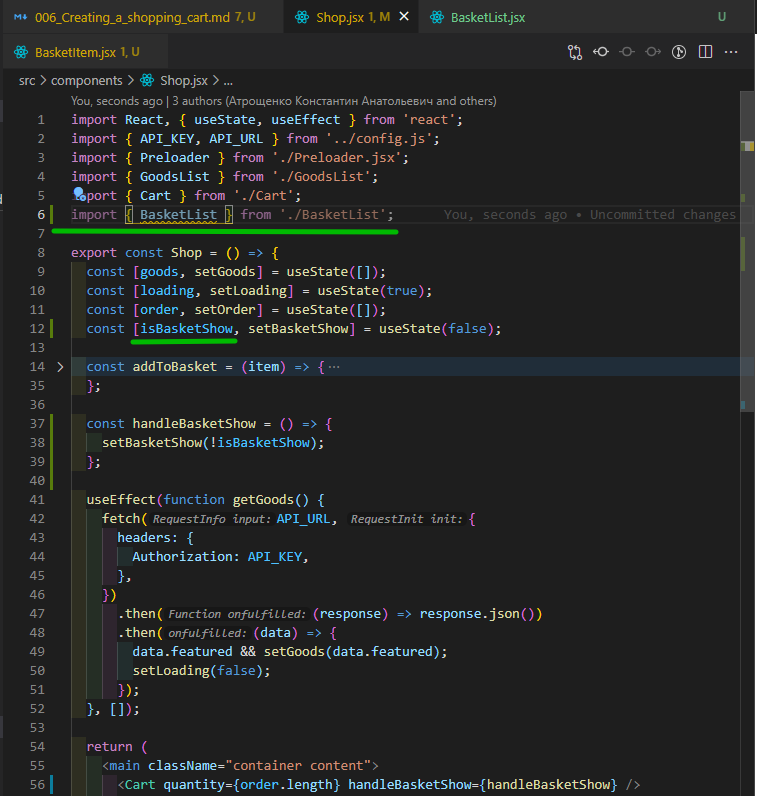

```jsx
import React, { useState, useEffect } from 'react';
import { API_KEY, API_URL } from '../config.js';
import { Preloader } from './Preloader.jsx';
import { GoodsList } from './GoodsList';
import { Cart } from './Cart';
import { BasketList } from './BasketList';

export const Shop = () => {
  const [goods, setGoods] = useState([]);
  const [loading, setLoading] = useState(true);
  const [order, setOrder] = useState([]);
  const [isBasketShow, setBasketShow] = useState(false);

  const addToBasket = (item) => {
    const itemIndex = order.findIndex((orderItem) => orderItem.id === item.id);
    if (itemIndex < 0) {
      const newItem = {
        ...item,
        quantity: 1,
      };
      setOrder([...order, newItem]);
    } else {
      const newOrder = order.map((orderItem, index) => {
        if (index === itemIndex) {
          return {
            ...orderItem,
            quantity: orderItem.quantity + 1,
          };
        } else {
          return orderItem;
        }
      });
      setOrder(newOrder);
    }
  };

  const handleBasketShow = () => {
    setBasketShow(!isBasketShow);
  };

  useEffect(function getGoods() {
    fetch(API_URL, {
      headers: {
        Authorization: API_KEY,
      },
    })
      .then((response) => response.json())
      .then((data) => {
        data.featured && setGoods(data.featured);
        setLoading(false);
      });
  }, []);

  return (
    <main className="container content">
      <Cart quantity={order.length} handleBasketShow={handleBasketShow} />
      {loading ? (
        <Preloader />
      ) : (
        <GoodsList goods={goods} addToBasket={addToBasket} />
      )}
    </main>
  );
};
```

И далее помним что у нас есть состояние показа Корзины.

Добавляю в разметку еще один **JSX**. И указываю что если **isBasketShow** активен то я добавляю **&&** компонент **BasketList** в котороый передаю список наших заказов.

```jsx
import React, { useState, useEffect } from 'react';
import { API_KEY, API_URL } from '../config.js';
import { Preloader } from './Preloader.jsx';
import { GoodsList } from './GoodsList';
import { Cart } from './Cart';
import { BasketList } from './BasketList';

export const Shop = () => {
  const [goods, setGoods] = useState([]);
  const [loading, setLoading] = useState(true);
  const [order, setOrder] = useState([]);
  const [isBasketShow, setBasketShow] = useState(false);

  const addToBasket = (item) => {
    const itemIndex = order.findIndex((orderItem) => orderItem.id === item.id);
    if (itemIndex < 0) {
      const newItem = {
        ...item,
        quantity: 1,
      };
      setOrder([...order, newItem]);
    } else {
      const newOrder = order.map((orderItem, index) => {
        if (index === itemIndex) {
          return {
            ...orderItem,
            quantity: orderItem.quantity + 1,
          };
        } else {
          return orderItem;
        }
      });
      setOrder(newOrder);
    }
  };

  const handleBasketShow = () => {
    setBasketShow(!isBasketShow);
  };

  useEffect(function getGoods() {
    fetch(API_URL, {
      headers: {
        Authorization: API_KEY,
      },
    })
      .then((response) => response.json())
      .then((data) => {
        data.featured && setGoods(data.featured);
        setLoading(false);
      });
  }, []);

  return (
    <main className="container content">
      <Cart quantity={order.length} handleBasketShow={handleBasketShow} />
      {loading ? (
        <Preloader />
      ) : (
        <GoodsList goods={goods} addToBasket={addToBasket} />
      )}
      {isBasketShow && <BasketList order={order} />}
    </main>
  );
};
```

И так по клику на корзину у меня внизу появляется вот такой вот список.

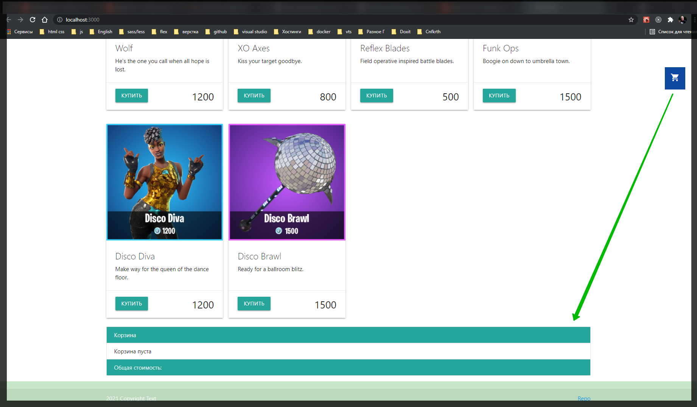

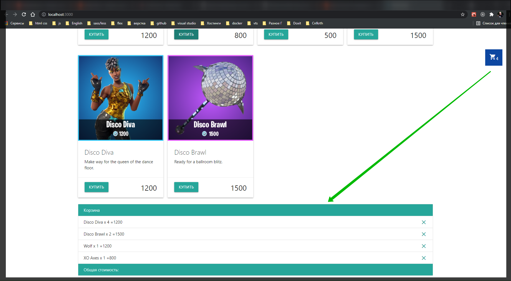

Однако корзина внизу это как-то не сильно удобно. Лучше что бы оно было всплывающим окном.

В BasketList списку добавляю еще один класс **basket-list** и я его сейчас буду стилизовать.

```jsx
import React from 'react';
import { BasketItem } from './BasketItem';

export const BasketList = (props) => {
  const { order = [] } = props;
  return (
    <ul className="collection basket-list">
      <li className="collection-item active">Корзина</li>
      {order.length ? (
        order.map((item) => <BasketItem key={item.id} {...item} />)
      ) : (
        <li className="collection-item">Корзина пуста</li>
      )}
      <li className="collection-item active">Общая стоимость:</li>
    </ul>
  );
};
```

```css
body {
  margin: 0;
  font-family: -apple-system, BlinkMacSystemFont, 'Segoe UI', 'Roboto',
    'Oxygen', 'Ubuntu', 'Cantarell', 'Fira Sans', 'Droid Sans',
    'Helvetica Neue', sans-serif;
  -webkit-font-smoothing: antialiased;
  -moz-osx-font-smoothing: grayscale;
}

code {
  font-family: source-code-pro, Menlo, Monaco, Consolas, 'Courier New',
    monospace;
}

nav {
  padding: 0 1rem;
}
.content {
  min-height: calc(100vh - 70px - 60px);
}
.goods {
  display: grid;
  grid-template-columns: repeat(auto-fill, minmax(250px, 1fr));
  gap: 1rem;
}

.card {
  display: flex;
  flex-direction: column;
}
.card-content {
  flex-grow: 1;
  /* С помощью того выровнял карточку как положено */
}
.price {
  font-size: 1.8rem;
}

.cart {
  position: fixed; /*Позиция корзины*/
  bottom: 2rem; /*на маленьком экране*/
  right: 2rem;
  cursor: pointer;
  z-index: 5; /*Делаю так что бы она всегда была по верх других элементов*/
  padding: 1rem;
}

@media (min-width: 767px) {
  .cart {
    top: 5rem;
    bottom: unset;
  }
}

.basket-list {
  position: fixed;
  top: 50%;
  left: 50%;
  transform: translate(-50%, -50%); /* что бы однозначно все было по центру*/
  background-color: white;
  width: 50rem;
  max-width: 95%; /* Если это маленькое устройство*/
  box-shadow: inset -1px 3px 8px 5px #1f87ff, 2px 5px 16px 0px #0b325e,
    5px 5px 15px 5px rgba(0, 0, 0, 0);
}
```

Хрен знает что за глюк. Но не сразу.

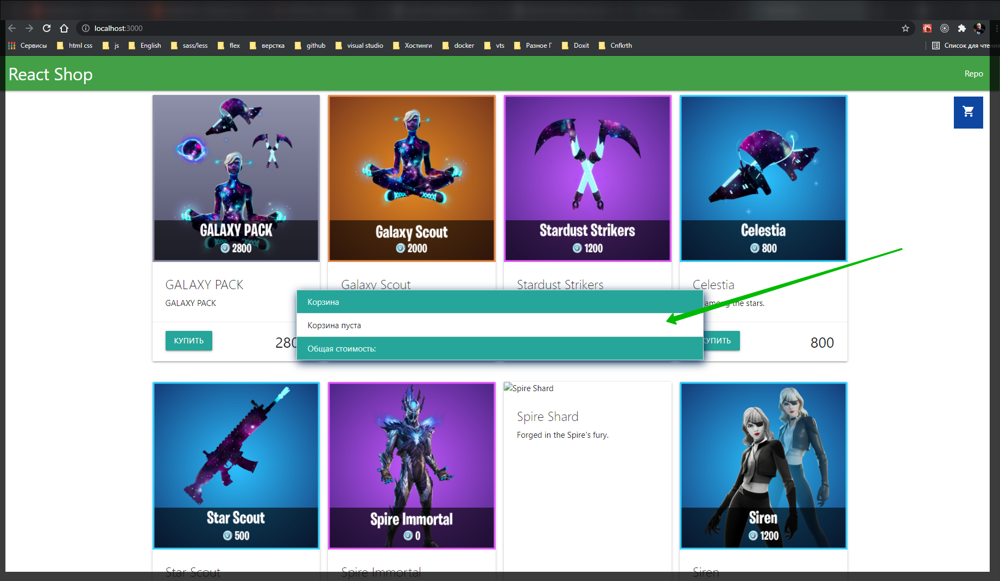

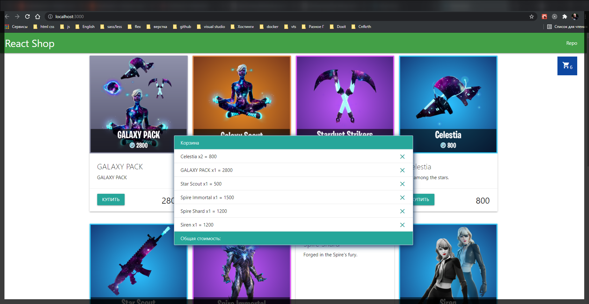

И теперь мне нужен еще общий крестик Корзины.

Поэтому функцию **handleBasketShow** которую я создавал в компоненте **Shop** мы должны в саму корзину **BasketList** в обязательном порядке спустить.

```jsx
import React, { useState, useEffect } from 'react';
import { API_KEY, API_URL } from '../config.js';
import { Preloader } from './Preloader.jsx';
import { GoodsList } from './GoodsList';
import { Cart } from './Cart';
import { BasketList } from './BasketList';

export const Shop = () => {
  const [goods, setGoods] = useState([]);
  const [loading, setLoading] = useState(true);
  const [order, setOrder] = useState([]);
  const [isBasketShow, setBasketShow] = useState(false);

  const addToBasket = (item) => {
    const itemIndex = order.findIndex((orderItem) => orderItem.id === item.id);
    if (itemIndex < 0) {
      const newItem = {
        ...item,
        quantity: 1,
      };
      setOrder([...order, newItem]);
    } else {
      const newOrder = order.map((orderItem, index) => {
        if (index === itemIndex) {
          return {
            ...orderItem,
            quantity: orderItem.quantity + 1,
          };
        } else {
          return orderItem;
        }
      });
      setOrder(newOrder);
    }
  };

  const handleBasketShow = () => {
    setBasketShow(!isBasketShow);
  };

  useEffect(function getGoods() {
    fetch(API_URL, {
      headers: {
        Authorization: API_KEY,
      },
    })
      .then((response) => response.json())
      .then((data) => {
        data.featured && setGoods(data.featured);
        setLoading(false);
      });
  }, []);

  return (
    <main className="container content">
      <Cart quantity={order.length} handleBasketShow={handleBasketShow} />
      {loading ? (
        <Preloader />
      ) : (
        <GoodsList goods={goods} addToBasket={addToBasket} />
      )}
      {isBasketShow && (
        <BasketList order={order} handleBasketShow={handleBasketShow} />
      )}
    </main>
  );
};
```

В **BasketList** я ее отлавливаю **handleBasketShow = Function.prototype**. И добавляю крестик. Помимо **materialize** класса **material-icon** задаю еще класс **basket-close** т.к. мнее ее еще нужно позиционировать.

```jsx
import React from 'react';
import { BasketItem } from './BasketItem';

export const BasketList = (props) => {
  const { order = [], handleBasketShow = Function.prototype } = props;
  return (
    <ul className="collection basket-list">
      <li className="collection-item active">Корзина</li>
      {order.length ? (
        order.map((item) => <BasketItem key={item.id} {...item} />)
      ) : (
        <li className="collection-item">Корзина пуста</li>
      )}
      <li className="collection-item active">Общая стоимость:</li>
      <i className="material-icons basket-close" onClick={handleBasketShow}>
        close
      </i>
    </ul>
  );
};
```

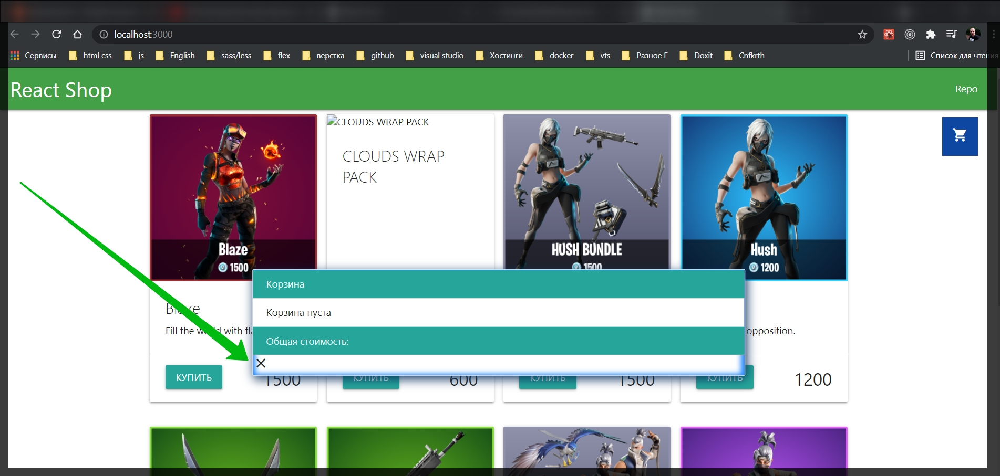

Я на нее кликаю и все закрывается.

Стили

```jsx
import React from 'react';
import { BasketItem } from './BasketItem';

export const BasketList = (props) => {
  const { order = [], handleBasketShow = Function.prototype } = props;
  return (
    <ul className="collection basket-list">
      <li className="collection-item active">Корзина</li>
      {order.length ? (
        order.map((item) => <BasketItem key={item.id} {...item} />)
      ) : (
        <li className="collection-item">Корзина пуста</li>
      )}
      <li className="collection-item active">Общая стоимость:</li>
      <i className="material-icons basket-close" onClick={handleBasketShow}>
        close
      </i>
    </ul>
  );
};
```

```jsx
import React from 'react';

export const BasketItem = (props) => {
  const { id, name, price, quantity } = props;
  return (
    <li className="collection-item  ">
      {name} x{quantity} = {price}
      <span className="secondary-content">
        <i className="material-icons basket-delete">close</i>
      </span>
    </li>
  );
};
```

```css
body {
  margin: 0;
  font-family: -apple-system, BlinkMacSystemFont, 'Segoe UI', 'Roboto',
    'Oxygen', 'Ubuntu', 'Cantarell', 'Fira Sans', 'Droid Sans',
    'Helvetica Neue', sans-serif;
  -webkit-font-smoothing: antialiased;
  -moz-osx-font-smoothing: grayscale;
}

code {
  font-family: source-code-pro, Menlo, Monaco, Consolas, 'Courier New',
    monospace;
}

nav {
  padding: 0 1rem;
}
.content {
  min-height: calc(100vh - 70px - 60px);
}
.goods {
  display: grid;
  grid-template-columns: repeat(auto-fill, minmax(250px, 1fr));
  gap: 1rem;
}

.card {
  display: flex;
  flex-direction: column;
}
.card-content {
  flex-grow: 1;
  /* С помощью того выровнял карточку как положено */
}
.price {
  font-size: 1.8rem;
}

.cart {
  position: fixed; /*Позиция корзины*/
  bottom: 2rem; /*на маленьком экране*/
  right: 2rem;
  cursor: pointer;
  z-index: 5; /*Делаю так что бы она всегда была по верх других элементов*/
  padding: 1rem;
}

@media (min-width: 767px) {
  .cart {
    top: 5rem;
    bottom: unset;
  }
}

.basket-list {
  position: fixed;
  top: 50%;
  left: 50%;
  transform: translate(-50%, -50%); /* что бы однозначно все было по центру*/
  background-color: white;
  width: 50rem;
  max-width: 95%; /* Если это маленькое устройство*/
  box-shadow: inset -1px 3px 8px 5px #1f87ff, 2px 5px 16px 0px #0b325e,
    5px 5px 15px 5px rgba(0, 0, 0, 0);
}

.basket-close {
  cursor: pointer;
  position: absolute;
  top: 0.5rem;
  right: 0.5rem;
  color: #fff;
}

.basket-delete {
  cursor: pointer;
}
```

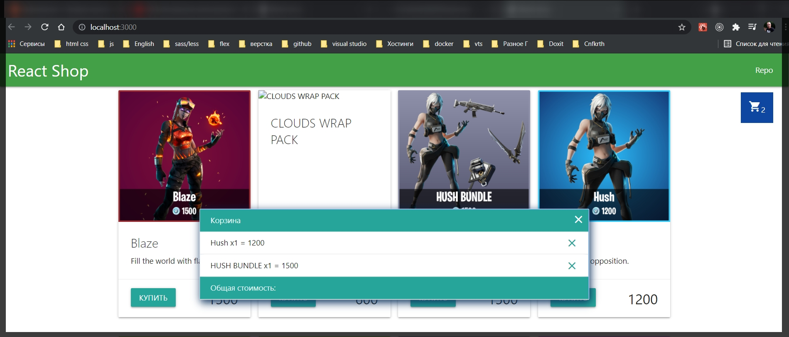

Теперь общая стоимость.

На уровне корзины **BasketList**. Нам даже состояние не нужно. Мы просто создадим отдельную переменную **totalPrice** и каждый раз когда мы будем получать список заказов мы будем обходить его методом **reduce** т.е. **order.reduce()**. Соотвественно **reduce** у нас принимает некий **callback** который будет обходить все наши значения поочередно и вторым параметром принимает некое значение по умолчанию которое будет **0**.

```jsx
import React from 'react';
import { BasketItem } from './BasketItem';

export const BasketList = (props) => {
  const { order = [], handleBasketShow = Function.prototype } = props;

  const totalPrice = order.reduce(() => {}, 0);

  return (
    <ul className="collection basket-list">
      <li className="collection-item active">Корзина</li>
      {order.length ? (
        order.map((item) => <BasketItem key={item.id} {...item} />)
      ) : (
        <li className="collection-item">Корзина пуста</li>
      )}
      <li className="collection-item active">Общая стоимость:</li>
      <i className="material-icons basket-close" onClick={handleBasketShow}>
        close
      </i>
    </ul>
  );
};
```

В параметр **callback** я принимаю некую sum. Сюда как раз попадет **0**. Мы будем эту сумму наращивать каждый раз обходя каждый элемент корзины. Для этого вторым параметром в **callback** принимаю сам элемент т.е. **el**. И в теле функции я буду возвращать старую **sum +** сумму итерируемого элемента **el.price** которую я буду перемножать на количество элементов **el.quantity**.

```jsx
import React from 'react';
import { BasketItem } from './BasketItem';

export const BasketList = (props) => {
  const { order = [], handleBasketShow = Function.prototype } = props;

  const totalPrice = order.reduce((sum, el) => {
    return sum + el.price * el.quantity; // предыдущая сумма + цена итерируемого элемена * на количество в массиве
  }, 0);

  return (
    <ul className="collection basket-list">
      <li className="collection-item active">Корзина</li>
      {order.length ? (
        order.map((item) => <BasketItem key={item.id} {...item} />)
      ) : (
        <li className="collection-item">Корзина пуста</li>
      )}
      <li className="collection-item active">
        Общая стоимость:{totalPrice} руб
      </li>
      <i className="material-icons basket-close" onClick={handleBasketShow}>
        close
      </i>
    </ul>
  );
};
```

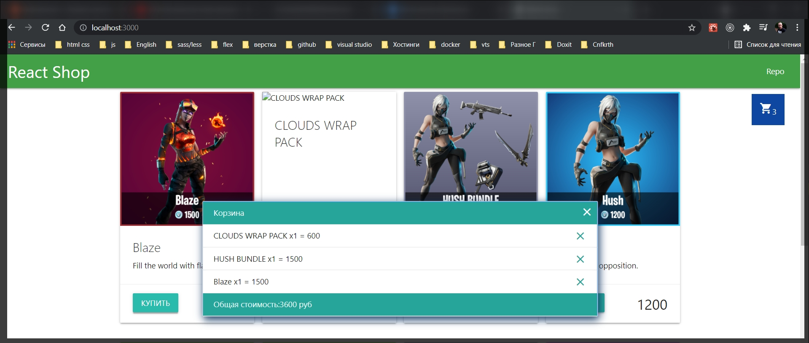
