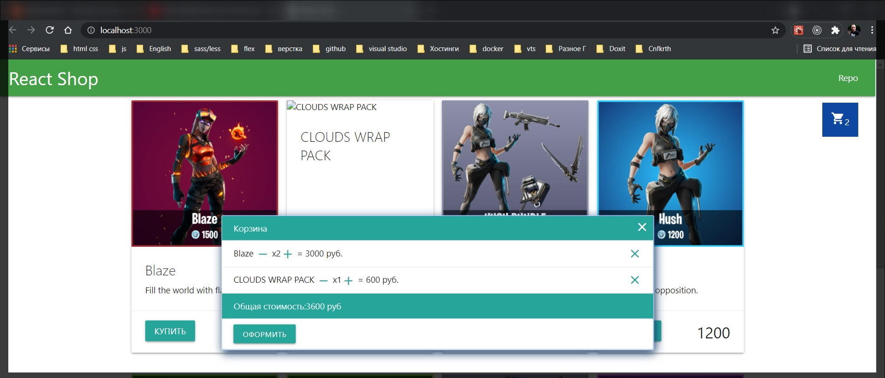
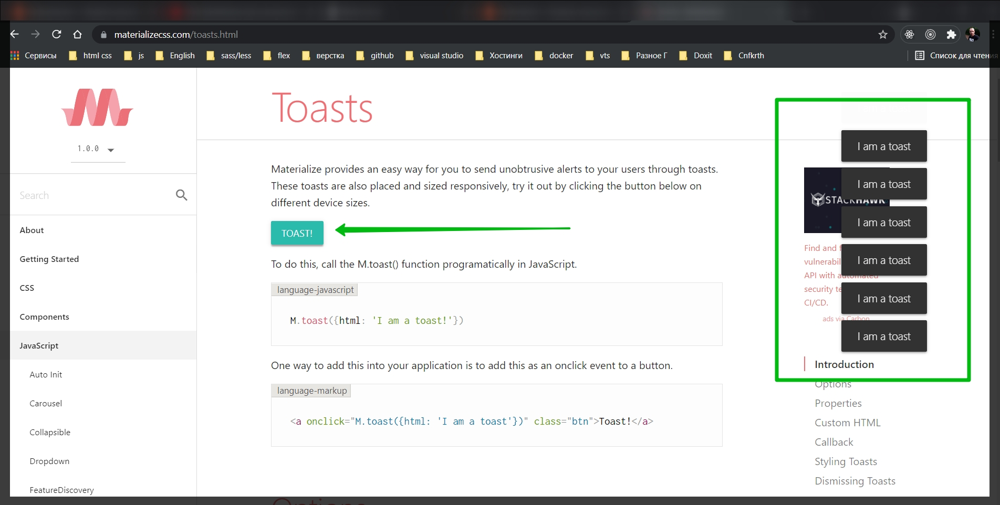
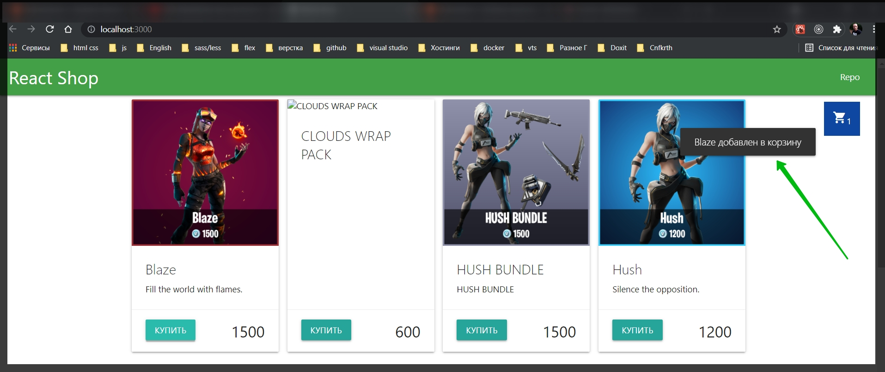

# Добавление подсказок

Сделаю кнопку Сделать заказ. Но так как нет **back-end** то она ничего делать не будет.

```jsx
import React from 'react';
import { BasketItem } from './BasketItem';

export const BasketList = (props) => {
  const {
    order = [],
    handleBasketShow = Function.prototype,
    removeFromBasket = Function.prototype,
    incQuantity,
    decQuantity,
  } = props;

  const totalPrice = order.reduce((sum, el) => {
    return sum + el.price * el.quantity; // предыдущая сумма + цена итерируемого элемена * на количество в массиве
  }, 0);

  return (
    <ul className="collection basket-list">
      <li className="collection-item active">Корзина</li>
      {order.length ? (
        order.map((item) => (
          <BasketItem
            key={item.id}
            {...item}
            removeFromBasket={removeFromBasket}
            incQuantity={incQuantity}
            decQuantity={decQuantity}
          />
        ))
      ) : (
        <li className="collection-item">Корзина пуста</li>
      )}
      <li className="collection-item active">
        Общая стоимость:{totalPrice} руб
      </li>
      <li className="collection-item ">
        <button className=" btn btn-small">Оформить</button>
      </li>
      <i className="material-icons basket-close" onClick={handleBasketShow}>
        close
      </i>
    </ul>
  );
};
```



Теперь по поводу подсказки. У **materialize** есть такая штука как **TOAST**.



Когда я кликаю плучаю вот такие подсказки. Она под капотом использует некий свой **JS**. Мы этого делать не будем.

Я сделаю по своему. Создаю компонент **Alert**

```jsx
import React from 'react';

export const Alert = (props) => {
  const { name } = props;

  return (
    <div id="toast-container">
      <div className="toast">{name} добавлен в корзину</div>
    </div>
  );
};
```

Так как у нас не будет внешнего **JS** мы будем создавать свой внутренний и по таймеру мы будем его скрывать.

Для этого мне понадобится **useEffect**.

```jsx
import React, { useEffect } from 'react';

export const Alert = (props) => {
  const { name } = props;

  useEffect(() => {}, [name]);

  return (
    <div id="toast-container">
      <div className="toast">{name} добавлен в корзину</div>
    </div>
  );
};
```

Отслеживать мы будем имя.

В теле функции создаю **timeId** который присваивает асинхронную функцию **setTimeout()**.

Дальше по сути что мне нужно? Мне нужно создать отдельный **prop** который будет отвечать за **name**.

На уровне приложения,в компоненте **Shop**, создаю состояние. Который по умолчанию будет пустой строкой.

```jsx
import React, { useState, useEffect } from 'react';
import { API_KEY, API_URL } from '../config.js';
import { Preloader } from './Preloader.jsx';
import { GoodsList } from './GoodsList';
import { Cart } from './Cart';
import { BasketList } from './BasketList';

export const Shop = () => {
  const [goods, setGoods] = useState([]);
  const [loading, setLoading] = useState(true);
  const [order, setOrder] = useState([]);
  const [isBasketShow, setBasketShow] = useState(false);
  const [alertName, setAlertName] = useState('');

  const addToBasket = (item) => {
    const itemIndex = order.findIndex((orderItem) => orderItem.id === item.id);
    if (itemIndex < 0) {
      const newItem = {
        ...item,
        quantity: 1,
      };
      setOrder([...order, newItem]);
    } else {
      const newOrder = order.map((orderItem, index) => {
        if (index === itemIndex) {
          return {
            ...orderItem,
            quantity: orderItem.quantity + 1,
          };
        } else {
          return orderItem;
        }
      });
      setOrder(newOrder);
    }
  };

  const removeFromBasket = (itemId) => {
    const newOrder = order.filter((el) => el.id !== itemId);
    setOrder(newOrder);
  };

  const incQuantity = (itemId) => {
    const newOrder = order.map((el) => {
      if (el.id === itemId) {
        const newQuantity = el.quantity + 1;
        return {
          ...el,
          quantity: newQuantity,
        };
      } else {
        return el;
      }
    });
    setOrder(newOrder);
  };
  const decQuantity = (itemId) => {
    const newOrder = order.map((el) => {
      if (el.id === itemId) {
        const newQuantity = el.quantity - 1;
        return {
          ...el,
          quantity: newQuantity >= 0 ? newQuantity : 0,
        };
      } else {
        return el;
      }
    });
    setOrder(newOrder);
  };

  const handleBasketShow = () => {
    setBasketShow(!isBasketShow);
  };

  useEffect(function getGoods() {
    fetch(API_URL, {
      headers: {
        Authorization: API_KEY,
      },
    })
      .then((response) => response.json())
      .then((data) => {
        data.featured && setGoods(data.featured);
        setLoading(false);
      });
  }, []);

  return (
    <main className="container content">
      <Cart quantity={order.length} handleBasketShow={handleBasketShow} />
      {loading ? (
        <Preloader />
      ) : (
        <GoodsList goods={goods} addToBasket={addToBasket} />
      )}
      {isBasketShow && (
        <BasketList
          order={order}
          handleBasketShow={handleBasketShow}
          removeFromBasket={removeFromBasket}
          incQuantity={incQuantity}
          decQuantity={decQuantity}
        />
      )}
    </main>
  );
};
```

Далее создаю функцию **closeAlert** которая будет выставлять **setAlert** на пустую строку. И данную функцию я буду пробрасывать в **Alert**. Пока что данный компонент он не подключает а сразу его отлавливает.

```jsx
import React, { useState, useEffect } from 'react';
import { API_KEY, API_URL } from '../config.js';
import { Preloader } from './Preloader.jsx';
import { GoodsList } from './GoodsList';
import { Cart } from './Cart';
import { BasketList } from './BasketList';

export const Shop = () => {
  const [goods, setGoods] = useState([]);
  const [loading, setLoading] = useState(true);
  const [order, setOrder] = useState([]);
  const [isBasketShow, setBasketShow] = useState(false);
  const [alertName, setAlertName] = useState('');

  const addToBasket = (item) => {
    const itemIndex = order.findIndex((orderItem) => orderItem.id === item.id);
    if (itemIndex < 0) {
      const newItem = {
        ...item,
        quantity: 1,
      };
      setOrder([...order, newItem]);
    } else {
      const newOrder = order.map((orderItem, index) => {
        if (index === itemIndex) {
          return {
            ...orderItem,
            quantity: orderItem.quantity + 1,
          };
        } else {
          return orderItem;
        }
      });
      setOrder(newOrder);
    }
  };

  const removeFromBasket = (itemId) => {
    const newOrder = order.filter((el) => el.id !== itemId);
    setOrder(newOrder);
  };

  const incQuantity = (itemId) => {
    const newOrder = order.map((el) => {
      if (el.id === itemId) {
        const newQuantity = el.quantity + 1;
        return {
          ...el,
          quantity: newQuantity,
        };
      } else {
        return el;
      }
    });
    setOrder(newOrder);
  };
  const decQuantity = (itemId) => {
    const newOrder = order.map((el) => {
      if (el.id === itemId) {
        const newQuantity = el.quantity - 1;
        return {
          ...el,
          quantity: newQuantity >= 0 ? newQuantity : 0,
        };
      } else {
        return el;
      }
    });
    setOrder(newOrder);
  };

  const handleBasketShow = () => {
    setBasketShow(!isBasketShow);
  };

  const closeAlert = () => {
    setAlertName('');
  };

  useEffect(function getGoods() {
    fetch(API_URL, {
      headers: {
        Authorization: API_KEY,
      },
    })
      .then((response) => response.json())
      .then((data) => {
        data.featured && setGoods(data.featured);
        setLoading(false);
      });
  }, []);

  return (
    <main className="container content">
      <Cart quantity={order.length} handleBasketShow={handleBasketShow} />
      {loading ? (
        <Preloader />
      ) : (
        <GoodsList goods={goods} addToBasket={addToBasket} />
      )}
      {isBasketShow && (
        <BasketList
          order={order}
          handleBasketShow={handleBasketShow}
          removeFromBasket={removeFromBasket}
          incQuantity={incQuantity}
          decQuantity={decQuantity}
        />
      )}
    </main>
  );
};
```

И после того как мы отловили данную функцию в **Alert** я ее вызываю спустя **3000**.

```js
import React, { useEffect } from 'react';

export const Alert = (props) => {
  const { name, closeAlert = Function.prototype } = props;

  useEffect(() => {
    const timerId = setTimeout(closeAlert, 3000);
  }, [name]);

  return (
    <div id="toast-container">
      <div className="toast">{name} добавлен в корзину</div>
    </div>
  );
};
```

Далее в **useEffect** сделаю функцию очистки что если вдруг у нас пришел новый name мы должны снять таймер и поставить новый.

```jsx
import React, { useEffect } from 'react';

export const Alert = (props) => {
  const { name, closeAlert = Function.prototype } = props;

  useEffect(() => {
    const timerId = setTimeout(closeAlert, 3000);
    return () => {
      clearTimeout(timerId);
    };
  }, [name]);

  return (
    <div id="toast-container">
      <div className="toast">{name} добавлен в корзину</div>
    </div>
  );
};
```

Теперь в **Shop** подключаю **Alert**.

```jsx
import React, { useState, useEffect } from 'react';
import { API_KEY, API_URL } from '../config.js';
import { Preloader } from './Preloader.jsx';
import { GoodsList } from './GoodsList';
import { Cart } from './Cart';
import { BasketList } from './BasketList';
import { Alert } from './Alert';

export const Shop = () => {
  const [goods, setGoods] = useState([]);
  const [loading, setLoading] = useState(true);
  const [order, setOrder] = useState([]);
  const [isBasketShow, setBasketShow] = useState(false);
  const [alertName, setAlertName] = useState('');

  const addToBasket = (item) => {
    const itemIndex = order.findIndex((orderItem) => orderItem.id === item.id);
    if (itemIndex < 0) {
      const newItem = {
        ...item,
        quantity: 1,
      };
      setOrder([...order, newItem]);
    } else {
      const newOrder = order.map((orderItem, index) => {
        if (index === itemIndex) {
          return {
            ...orderItem,
            quantity: orderItem.quantity + 1,
          };
        } else {
          return orderItem;
        }
      });
      setOrder(newOrder);
    }
  };

  const removeFromBasket = (itemId) => {
    const newOrder = order.filter((el) => el.id !== itemId);
    setOrder(newOrder);
  };

  const incQuantity = (itemId) => {
    const newOrder = order.map((el) => {
      if (el.id === itemId) {
        const newQuantity = el.quantity + 1;
        return {
          ...el,
          quantity: newQuantity,
        };
      } else {
        return el;
      }
    });
    setOrder(newOrder);
  };
  const decQuantity = (itemId) => {
    const newOrder = order.map((el) => {
      if (el.id === itemId) {
        const newQuantity = el.quantity - 1;
        return {
          ...el,
          quantity: newQuantity >= 0 ? newQuantity : 0,
        };
      } else {
        return el;
      }
    });
    setOrder(newOrder);
  };

  const handleBasketShow = () => {
    setBasketShow(!isBasketShow);
  };

  const closeAlert = () => {
    setAlertName('');
  };

  useEffect(function getGoods() {
    fetch(API_URL, {
      headers: {
        Authorization: API_KEY,
      },
    })
      .then((response) => response.json())
      .then((data) => {
        data.featured && setGoods(data.featured);
        setLoading(false);
      });
  }, []);

  return (
    <main className="container content">
      <Cart quantity={order.length} handleBasketShow={handleBasketShow} />
      {loading ? (
        <Preloader />
      ) : (
        <GoodsList goods={goods} addToBasket={addToBasket} />
      )}
      {isBasketShow && (
        <BasketList
          order={order}
          handleBasketShow={handleBasketShow}
          removeFromBasket={removeFromBasket}
          incQuantity={incQuantity}
          decQuantity={decQuantity}
        />
      )}
    </main>
  );
};
```

И дальше я буду проверять что если у нас **alertName** есть то тогда выведи нам его **&& Alert**.

```jsx
import React, { useState, useEffect } from 'react';
import { API_KEY, API_URL } from '../config.js';
import { Preloader } from './Preloader.jsx';
import { GoodsList } from './GoodsList';
import { Cart } from './Cart';
import { BasketList } from './BasketList';
import { Alert } from './Alert';

export const Shop = () => {
  const [goods, setGoods] = useState([]);
  const [loading, setLoading] = useState(true);
  const [order, setOrder] = useState([]);
  const [isBasketShow, setBasketShow] = useState(false);
  const [alertName, setAlertName] = useState('');

  const addToBasket = (item) => {
    const itemIndex = order.findIndex((orderItem) => orderItem.id === item.id);
    if (itemIndex < 0) {
      const newItem = {
        ...item,
        quantity: 1,
      };
      setOrder([...order, newItem]);
    } else {
      const newOrder = order.map((orderItem, index) => {
        if (index === itemIndex) {
          return {
            ...orderItem,
            quantity: orderItem.quantity + 1,
          };
        } else {
          return orderItem;
        }
      });
      setOrder(newOrder);
    }
  };

  const removeFromBasket = (itemId) => {
    const newOrder = order.filter((el) => el.id !== itemId);
    setOrder(newOrder);
  };

  const incQuantity = (itemId) => {
    const newOrder = order.map((el) => {
      if (el.id === itemId) {
        const newQuantity = el.quantity + 1;
        return {
          ...el,
          quantity: newQuantity,
        };
      } else {
        return el;
      }
    });
    setOrder(newOrder);
  };
  const decQuantity = (itemId) => {
    const newOrder = order.map((el) => {
      if (el.id === itemId) {
        const newQuantity = el.quantity - 1;
        return {
          ...el,
          quantity: newQuantity >= 0 ? newQuantity : 0,
        };
      } else {
        return el;
      }
    });
    setOrder(newOrder);
  };

  const handleBasketShow = () => {
    setBasketShow(!isBasketShow);
  };

  const closeAlert = () => {
    setAlertName('');
  };

  useEffect(function getGoods() {
    fetch(API_URL, {
      headers: {
        Authorization: API_KEY,
      },
    })
      .then((response) => response.json())
      .then((data) => {
        data.featured && setGoods(data.featured);
        setLoading(false);
      });
  }, []);

  return (
    <main className="container content">
      <Cart quantity={order.length} handleBasketShow={handleBasketShow} />
      {loading ? (
        <Preloader />
      ) : (
        <GoodsList goods={goods} addToBasket={addToBasket} />
      )}
      {isBasketShow && (
        <BasketList
          order={order}
          handleBasketShow={handleBasketShow}
          removeFromBasket={removeFromBasket}
          incQuantity={incQuantity}
          decQuantity={decQuantity}
        />
      )}
      {alertName && <Alert name={alertName} closeAlert={closeAlert} />}
    </main>
  );
};
```

Как мы будем устанавливать **name**?

У нас есть функция которая называется **addToBasket**. И просто в момент когда мы что-то добавляем в корзину. Мы имя которое добавляем в корзину будем добавлять в наш **alertName**.

```jsx
import React, { useState, useEffect } from 'react';
import { API_KEY, API_URL } from '../config.js';
import { Preloader } from './Preloader.jsx';
import { GoodsList } from './GoodsList';
import { Cart } from './Cart';
import { BasketList } from './BasketList';
import { Alert } from './Alert';

export const Shop = () => {
  const [goods, setGoods] = useState([]);
  const [loading, setLoading] = useState(true);
  const [order, setOrder] = useState([]);
  const [isBasketShow, setBasketShow] = useState(false);
  const [alertName, setAlertName] = useState('');

  const addToBasket = (item) => {
    const itemIndex = order.findIndex((orderItem) => orderItem.id === item.id);
    if (itemIndex < 0) {
      const newItem = {
        ...item,
        quantity: 1,
      };
      setOrder([...order, newItem]);
    } else {
      const newOrder = order.map((orderItem, index) => {
        if (index === itemIndex) {
          return {
            ...orderItem,
            quantity: orderItem.quantity + 1,
          };
        } else {
          return orderItem;
        }
      });
      setOrder(newOrder);
    }
    setAlertName(item.name);
  };

  const removeFromBasket = (itemId) => {
    const newOrder = order.filter((el) => el.id !== itemId);
    setOrder(newOrder);
  };

  const incQuantity = (itemId) => {
    const newOrder = order.map((el) => {
      if (el.id === itemId) {
        const newQuantity = el.quantity + 1;
        return {
          ...el,
          quantity: newQuantity,
        };
      } else {
        return el;
      }
    });
    setOrder(newOrder);
  };
  const decQuantity = (itemId) => {
    const newOrder = order.map((el) => {
      if (el.id === itemId) {
        const newQuantity = el.quantity - 1;
        return {
          ...el,
          quantity: newQuantity >= 0 ? newQuantity : 0,
        };
      } else {
        return el;
      }
    });
    setOrder(newOrder);
  };

  const handleBasketShow = () => {
    setBasketShow(!isBasketShow);
  };

  const closeAlert = () => {
    setAlertName('');
  };

  useEffect(function getGoods() {
    fetch(API_URL, {
      headers: {
        Authorization: API_KEY,
      },
    })
      .then((response) => response.json())
      .then((data) => {
        data.featured && setGoods(data.featured);
        setLoading(false);
      });
  }, []);

  return (
    <main className="container content">
      <Cart quantity={order.length} handleBasketShow={handleBasketShow} />
      {loading ? (
        <Preloader />
      ) : (
        <GoodsList goods={goods} addToBasket={addToBasket} />
      )}
      {isBasketShow && (
        <BasketList
          order={order}
          handleBasketShow={handleBasketShow}
          removeFromBasket={removeFromBasket}
          incQuantity={incQuantity}
          decQuantity={decQuantity}
        />
      )}
      {alertName && <Alert name={alertName} closeAlert={closeAlert} />}
    </main>
  );
};
```



```jsx
body {
  margin: 0;
  font-family: -apple-system, BlinkMacSystemFont, 'Segoe UI', 'Roboto', 'Oxygen',
    'Ubuntu', 'Cantarell', 'Fira Sans', 'Droid Sans', 'Helvetica Neue',
    sans-serif;
  -webkit-font-smoothing: antialiased;
  -moz-osx-font-smoothing: grayscale;
}

code {
  font-family: source-code-pro, Menlo, Monaco, Consolas, 'Courier New',
    monospace;
}

nav {
  padding: 0 1rem;
}
.content {
  min-height: calc(100vh - 70px - 60px);
}
.goods {
  display: grid;
  grid-template-columns: repeat(auto-fill, minmax(250px, 1fr));
  gap: 1rem;
}

.card {
  display: flex;
  flex-direction: column;
}
.card-content {
  flex-grow: 1;
  /* С помощью того выровнял карточку как положено */
}
.price {
  font-size: 1.8rem;
}

.cart {
  position: fixed; /*Позиция корзины*/
  bottom: 2rem; /*на маленьком экране*/
  right: 2rem;
  cursor: pointer;
  z-index: 5; /*Делаю так что бы она всегда была по верх других элементов*/
  padding: 1rem;
}

@media (min-width: 767px) {
  .cart {
    top: 5rem;
    bottom: unset;
  }
}

.basket-list {
  position: fixed;
  top: 50%;
  left: 50%;
  transform: translate(-50%, -50%); /* что бы однозначно все было по центру*/
  background-color: white;
  width: 50rem;
  max-width: 95%; /* Если это маленькое устройство*/
  box-shadow: inset -1px 3px 8px 5px #1f87ff, 2px 5px 16px 0px #0b325e,
    5px 5px 15px 5px rgba(0, 0, 0, 0);
  animation: show 500ms ease-in-out;
}

.basket-close {
  cursor: pointer;
  position: absolute;
  top: 0.5rem;
  right: 0.5rem;
  color: #fff;
}

.basket-delete {
  cursor: pointer;
}

/* Анимация на Корзину из одного состояния в другое. show придуманное название и в basket-list прописываю данную анимацию */
@keyframes show {
  from {
    top: 70%;
    opacity: 0;
  }
  to {
    top: 50%;
    opacity: 1;
  }
}

.basket-quantity {
  cursor: pointer;
  vertical-align: middle; /*Выравнивание средней точки элемента по базовой линии родителя плюс половина высоты родительского элемента*/
  color: #26a69a;
}

/* Alert */
#toast-container {
  top: 3rem !important;
  animation: fade-in 250ms ease-in-out;
}

@keyframes fade-in {
  from {
    opacity: 0;
    transform: translateY(2rem);
  }
  to {
    opacity: 1;
    transform: translateY(0rem);
  }
}
```
