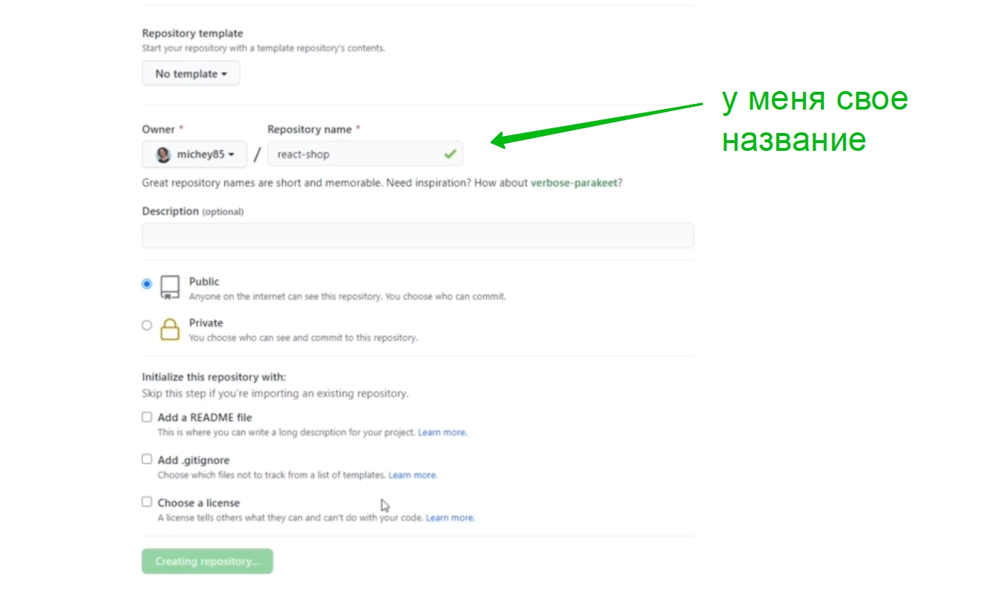
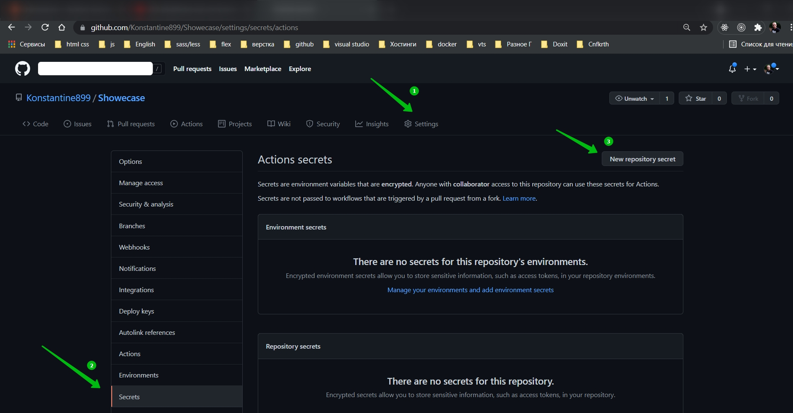
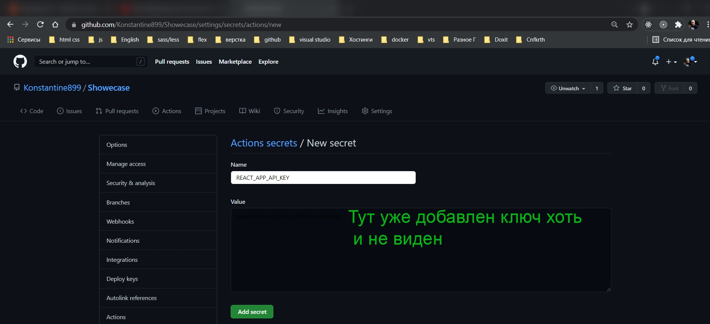
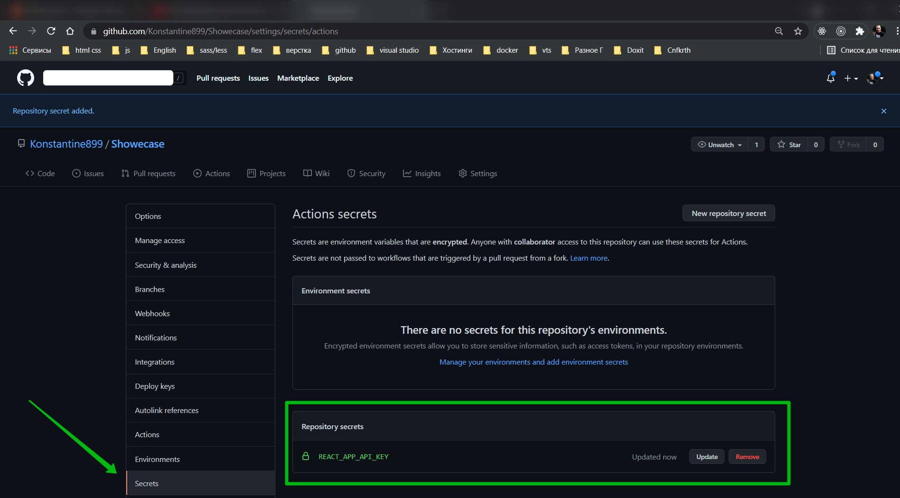
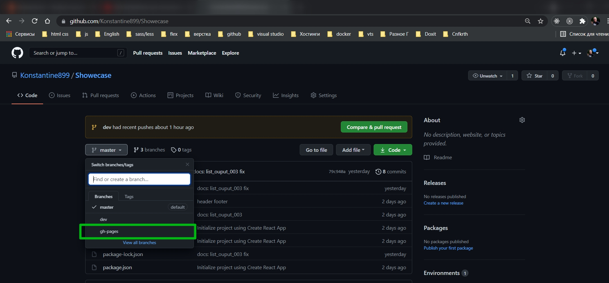
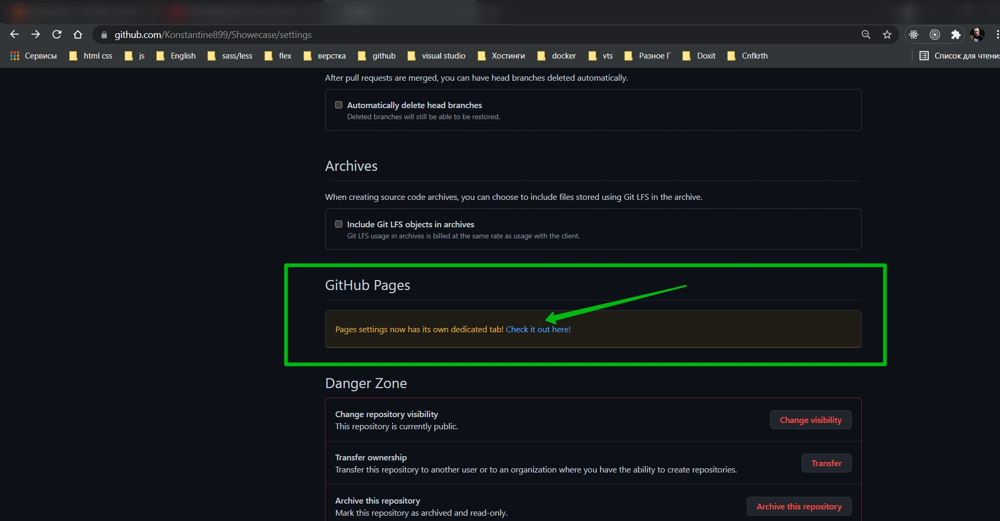
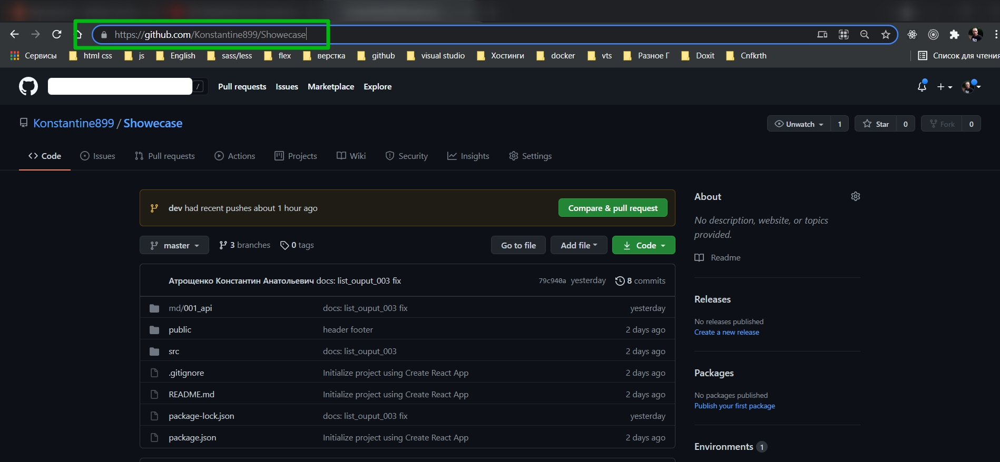

# Публикация на github

И так у меня есть готовое приложение которое я готов собирать в production.

Как обычно добавляю новый репозиторий.



После того как залили проект в удаленный репозиторий. Захожу в Settings во вкладку Secrets. И здесь нужно добавить наш API_KEY.







Далее мне нужно установить пакет gh-pages

```shell
npm i gh-pages -D
```

Важно дожтаться окончания установки. Потому что если сразу мы начнем править package.json, то у нас будет конфликт потому что сам npm мэнеджер после установки вносит изменения.

После установки нам в package.json нужно прописать нескольковещей.

Для начало добавляю домашнюю страницу. homepage:"https://имя учетной записи/ и название репозитория" т.е. примерно так "homepage": "https://Konstantine899.github.io/Showecase",

Далее добавляю два скрипта. "predeploy": "npm run build", и "deploy": "gh-pages -d build".

```json
{
  "name": "showecase",
  "homepage": "https://Konstantine899.github.io/Showecase",
  "version": "0.1.0",
  "private": true,
  "dependencies": {
    "@testing-library/jest-dom": "^5.14.1",
    "@testing-library/react": "^11.2.7",
    "@testing-library/user-event": "^12.8.3",
    "react": "^17.0.2",
    "react-dom": "^17.0.2",
    "react-scripts": "4.0.3",
    "web-vitals": "^1.1.2"
  },
  "scripts": {
    "start": "react-scripts start",
    "build": "react-scripts build",
    "test": "react-scripts test",
    "eject": "react-scripts eject",
    "predeploy": "npm run build",
    "deploy": "gh-pages -d build"
  },
  "eslintConfig": {
    "extends": ["react-app", "react-app/jest"]
  },
  "browserslist": {
    "production": [">0.2%", "not dead", "not op_mini all"],
    "development": [
      "last 1 chrome version",
      "last 1 firefox version",
      "last 1 safari version"
    ]
  },
  "devDependencies": {
    "gh-pages": "^3.2.3"
  }
}
```

И запускаю

```shell
npm run deploy
```

В удаленном репозитории появляется ветка gh-pages.



Переходим в эту ветку и смотрим в Settings включенал данная ветка.




Иногда нужно подождать для того что бы эта ссылка заработала.

Собственно пока ждем мы можем подкорректировать Header с Footer так как у нас есть вполне конкретная ссылка на репозиторий.



```jsx
import React from 'react';

export const Header = () => {
  return (
    <nav className="green darken-1">
      <div className="nav-wrapper">
        <a href="/" className="brand-logo">
          React Shop
        </a>
        <ul className="right hide-on-med-and-down">
          <li>
            <a
              href="https://github.com/Konstantine899/Showecase"
              rel="noreferrer"
              target="_blank"
            >
              Repo
            </a>
          </li>
        </ul>
      </div>
    </nav>
  );
};
```

```jsx
import React from 'react';

export const Footer = () => {
  return (
    <footer className="page-footer green  lighten-4">
      <div className="footer-copyright">
        <div className="container">
          {new Date().getFullYear()} Copyright Text
          <a
            href="https://github.com/Konstantine899/Showecase"
            className="gray-text text-lighten-4 right"
            rel="noreferrer"
            target="_blank"
          >
            Repo
          </a>
        </div>
      </div>
    </footer>
  );
};
```

И коммитим все в ветку gh-pages.

У меня не получается.

Он все делает вот так добавляет изменения

```shell
git add -A
```

```shell
git commit -m "gh-pages added"
```

```shell
git push
```

И так мое предположение что он берет все из ветки master. Значит если у меня есть ветка dev значит ее нужно слить.
