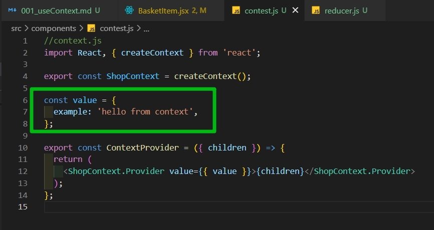
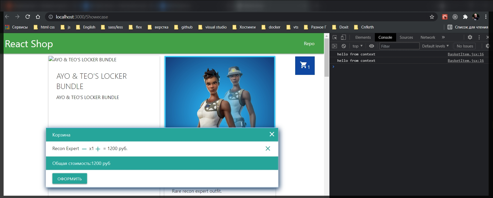

# 076 Создание контекста с провайдером

И так сейчас в приложении у меня есть аж 5 едениц state на уровне нашего Shop. Есть некоторое количество функций которые у нас пробрасываются вниз. Мы постараемся обойтись одним state. Мы будем использовать useReducer. И соотвеисивено для каждой функции создать свой обработчик который мы будем пробрасывать к компонентам.

Начнем по порядку. В этом видео мы подготовим некий Context который будем в дальнейшем использовать.

Можно по разому это организовывать. Создать отдельную папку для Context, отдельную папку для Reducers, отдельную папку для Actions. Мы не будем здесь сильно углубляться в структуру.

Мы создадим на уровне src папку Context. Точнее не папку а файл context.js и соответственно reducer.js.

И сейчас мы поработаем с context.js.

Первым делом я должен импортировать такую штуку как createContext.

```jsx
//context.js
import React, { createContext } from 'react';
```

Первое что я сделаю это создам константу которую экспортирую . В дальнейшем мы будем ее импортировать в разные места которая и будет являтся собственно контекстом.

```js
//context.js
import React, { createContext } from 'react';

export const ShopContext = createContext();
```

Помним что ShopContext дает нам под капотом некий Provider который мы будем собственно испольььзовать что бы пробрасывать данные . И нам нужен некий компонент который будет являтся оберткой для всего остального т.е. мы обернем все наше приложение Shop в некую дополнительную обертку. И через эту обертку мы будем пробрасывать все какие-то возможные prop, но не как prop а через Context.

Называю ее как ContextProvider. И действовать она будет следующим образом. Данная функция будет принимать {children}. Ну по сути она будет принимать один prop children и мы его будем использовать. И она нам будет возвращать ShopContext, а если быть точным его Provider т.е. ShopContext.Provider. И посути все shildren которые она получит, она им будет что-то пробрасывать. Соответственно пробрасывать она будет некий value. И для простоты пока что заготовлю некий value.

```js
//context.js
import React, { createContext } from 'react';

export const ShopContext = createContext();

const value = {
  example: 'hello from context',
};

export const ContextProvider = ({ children }) => {
  return (
    <ShopContext.Provider value={{ value }}>{children}</ShopContext.Provider>
  );
};
```

И использовать мы это будем на уровне приложения, а именно в главном файле App.js. В Provider мы по сути обернем наш компонент Shop. Shop будет как раз тем самым children, и все дочерние элементы Shop тоже будут по сути наследовать то что есть в Provider.

```js
import React from 'react';
import { Header } from './components/Header.jsx';
import { Footer } from './components//Footer.jsx';
import { Shop } from './components/Shop.jsx';
import { ContextProvider } from './components/contest.js';

function App() {
  return (
    <>
      <Header />
      <ContextProvider>
        <Shop />
      </ContextProvider>
      <Footer />
    </>
  );
}

export default App;
```

Теперь по сути я могу в компонте которы лежит на самом глубоком уровне, а имеено BuscketItem я могу сказать. В нем я импортирую хук useContext. Далее я импортирую сам ShopContext.

```jsx
import React, { useContext } from 'react';
import { ShopContext } from './contest.js';

export const BasketItem = (props) => {
  const {
    id,
    name,
    price,
    quantity,
    removeFromBasket = Function.prototype,
    incQuantity = Function.prototype,
    decQuantity = Function.prototype,
  } = props;

  return (
    <li className="collection-item  ">
      {name}{' '}
      <li
        className="material-icons basket-quantity"
        onClick={() => decQuantity(id)}
      >
        remove
      </li>{' '}
      x{quantity}
      <li
        className="material-icons basket-quantity"
        onClick={() => incQuantity(id)}
      >
        add
      </li> = {price * quantity} руб.
      <span className="secondary-content" onClick={() => removeFromBasket(id)}>
        <i className="material-icons basket-delete">close</i>
      </span>
    </li>
  );
};
```

Далее я могу делать диструктуризацию из const {} = useContext(). В параметрах указываю какой контекст мне нужно задействовать. const {} = useContext(ShopContext). И далее указываю что из данного контекста мне нужно вытащить. Мы можем указать вот так const value = useContext() и это будет обозначать что мы забираем все значения которые мы передаем. Т.е. весь вот этот вот объект сколько бы там ключей небыло.



Но как правило это не требуется. Нам нужет один ключ который там есть и мы его назвали example.

```jsx
import React, { useContext } from 'react';
import { ShopContext } from './contest.js';

export const BasketItem = (props) => {
  const {
    id,
    name,
    price,
    quantity,
    removeFromBasket = Function.prototype,
    incQuantity = Function.prototype,
    decQuantity = Function.prototype,
  } = props;

  const { example } = useContext(ShopContext);
  console.log(example);

  return (
    <li className="collection-item  ">
      {name}{' '}
      <li
        className="material-icons basket-quantity"
        onClick={() => decQuantity(id)}
      >
        remove
      </li>{' '}
      x{quantity}
      <li
        className="material-icons basket-quantity"
        onClick={() => incQuantity(id)}
      >
        add
      </li> = {price * quantity} руб.
      <span className="secondary-content" onClick={() => removeFromBasket(id)}>
        <i className="material-icons basket-delete">close</i>
      </span>
    </li>
  );
};
```

И когда я открываю корзину я должен получить соответствующий вывод.

У меня выводится undefined. А при чина довольна проста. При передаче в value объекта не нужно указывать двойные фигурные скобки. Т.к. это и так уже объект. Просто получается что я объект передаю reference а не напрямую прописываю в value.

```jsx
//context.js
import React, { createContext } from 'react';

export const ShopContext = createContext();

const value = {
  example: 'hello from context',
};

export const ContextProvider = ({ children }) => {
  return <ShopContext.Provider value={value}>{children}</ShopContext.Provider>;
};
```


