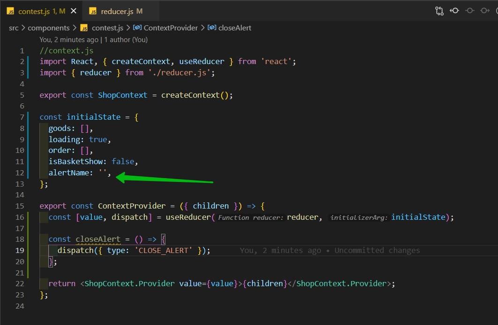

# Создание useReducer

И так **reducer** это функция которую мы будем экспортировать и она допустим будет называться **reducer**. И мы помним что эта функция принимает **state**, **action** (порядок важен). Причем **action** это некий объект. В нашем случае этот объект будет принимать два поля это **type** и **payload**. Таким образом я сразу делаю диструктуризацию для того что бы в дальнейшем упрощенную запись в дальнейшем использовать.

```js
export const reducer = (state, { type, payload }) => {};
```

В простейшем варианте мы помним что мы просто можем вернуть **state**. Либо делать соотвтетствущие манипуляции над этим состоянием и что-то менять. Я использую **switch case**. Я через **switch** буду пробегаться по **type** и смотреть какие там есть варианты значения. И если ни один из вариантов не выполниться то я возвращаю **state** таким как он был.

```js
export const reducer = (state, { type, payload }) => {
  switch (type) {
    default:
      return state;
  }
};
```

В компоненте **Shop** у меня есть событие **closeAlertName**.

Соотвтествтенно когда мы хотим сделать type.... **Context** соответственно будет принимать некий **reducer**. Для его использования я исппользую в контексте хук **useReducer**

```js
//context.js
import React, { createContext, useReducer } from 'react';
import { reducer } from './reducer.js';

export const ShopContext = createContext();

const value = {
  example: 'hello from context',
};

export const ContextProvider = ({ children }) => {
  return <ShopContext.Provider value={value}>{children}</ShopContext.Provider>;
};
```

Далее мне нужно некое значение по умолчанию. Для этого создаю объект **initialState**

```jsx
//context.js
import React, { createContext, useReducer } from 'react';
import { reducer } from './reducer.js';

export const ShopContext = createContext();

const initialState = {};

const value = {
  example: 'hello from context',
};

export const ContextProvider = ({ children }) => {
  return <ShopContext.Provider value={value}>{children}</ShopContext.Provider>;
};
```

По сути я должен эмулировать все значения из **Shop**.


И вот некое значение по умолчанию

```js
//context.js
import React, { createContext, useReducer } from 'react';
import { reducer } from './reducer.js';

export const ShopContext = createContext();

const initialState = {
  goods: [],
  loading: true,
  order: [],
  isBasketShow: false,
  alertName: '',
};

const value = {
  example: 'hello from context',
};

export const ContextProvider = ({ children }) => {
  return <ShopContext.Provider value={value}>{children}</ShopContext.Provider>;
};
```

Далее я создаю две пары значения через **useReducer** который парвым параметром принимает сам **reducer**, а вторым начальное состояние **initialState**. Далее в получаемом массиве я получаю данные ключи. В принципе я их так и могу называть **value**. И вторым параметром принимает фукцию обновления которая обычно нозывается **dispatch** т.е. некий диспетчер событий.

```js
//context.js
import React, { createContext, useReducer } from 'react';
import { reducer } from './reducer.js';

export const ShopContext = createContext();

const initialState = {
  goods: [],
  loading: true,
  order: [],
  isBasketShow: false,
  alertName: '',
};

export const ContextProvider = ({ children }) => {
  const [value, dispatch] = useReducer(reducer, initialState);
  return <ShopContext.Provider value={value}>{children}</ShopContext.Provider>;
};
```

И для вызовов мы будем говорить: вызови нам событие такое-то. Набор данных будет такой-то.

Ну, например, мы можем здесь создать отдельный функции скащем положить функции в наш **value**. Мы знаем что наш **value** это объект. Это значит что мы можем добавить ему ключ.

Допустим это будет ключ **closeAlert** т.е. **value.closeAlert**. Он у нас будет собой являть некую функцию которая просто под капотом будет вызывать **dispatch** и принимать некое событие, некий **action**.

Иногда **action** хранят отдельно, для удобства. Мы сейчас не будем это разбивать на отдельные файлы.

```js
//context.js
import React, { createContext, useReducer } from 'react';
import { reducer } from './reducer.js';

export const ShopContext = createContext();

const initialState = {
  goods: [],
  loading: true,
  order: [],
  isBasketShow: false,
  alertName: '',
};

export const ContextProvider = ({ children }) => {
  const [value, dispatch] = useReducer(reducer, initialState);

  value.closeAlert = () => {
    dispatch({ type: 'CLOSE_ALERT' });
  };

  return <ShopContext.Provider value={value}>{children}</ShopContext.Provider>;
};
```

И таким образом мы будем сюда создавать иметацию всех функций. Они будут делать **dispatch** событий. И если мы здесь что-то получили, то это то что мы получили мы должны будем положить в ключик **payload**.

Далее файл **reducer** должен это состояние обработать. Мы должны проверить что case если он равняется вот этому состоянию **'CLOSE_ALERT'**, то мы должны нечто изменить. Мы должны обратно вернуть влюбом случае state. И один его ключик точечно поменять. Мы знаем что у нас есть ключ **alertName**



И мы знаем что мы должны его просто сбросить до пустой строки.

```js
export const reducer = (state, { type, payload }) => {
  switch (type) {
    case 'CLOSE_ALERT':
      return { ...state, alertName: '' };
    default:
      return state;
  }
};
```

Чуть более сложная история.

Допустим **removeFromBusket** . Соответственно в контексте объекту **value** добавляю функцию **removeFromBusket**. Она принимает некий **itemId**. Под капотом будет вызывать **dispatch** и говорить что тип события у нас **REMOVE_FROM_BUSKET**. Но здесь мы будем передавать **payload** и будем передавать его как объект.

```js
//context.js
import React, { createContext, useReducer } from 'react';
import { reducer } from './reducer.js';

export const ShopContext = createContext();

const initialState = {
  goods: [],
  loading: true,
  order: [],
  isBasketShow: false,
  alertName: '',
};

export const ContextProvider = ({ children }) => {
  const [value, dispatch] = useReducer(reducer, initialState);

  value.removeFromBasket = (itemId) => {
    dispatch({ type: 'REMOVE_FROM_BASKET', payload: {} });
  };

  value.closeAlert = () => {
    dispatch({ type: 'CLOSE_ALERT' });
  };

  return <ShopContext.Provider value={value}>{children}</ShopContext.Provider>;
};
```

И в данном случае у нас просто **id** который мы будем передавать **id:** равный **itemId**.

```js
//context.js
import React, { createContext, useReducer } from 'react';
import { reducer } from './reducer.js';

export const ShopContext = createContext();

const initialState = {
  goods: [],
  loading: true,
  order: [],
  isBasketShow: false,
  alertName: '',
};

export const ContextProvider = ({ children }) => {
  const [value, dispatch] = useReducer(reducer, initialState);

  value.removeFromBasket = (itemId) => {
    dispatch({ type: 'REMOVE_FROM_BASKET', payload: { id: itemId } });
  };

  value.closeAlert = () => {
    dispatch({ type: 'CLOSE_ALERT' });
  };

  return <ShopContext.Provider value={value}>{children}</ShopContext.Provider>;
};
```

В случае с reducer мы должны создать соответствующий **case**.

```js
export const reducer = (state, { type, payload }) => {
  switch (type) {
    case 'CLOSE_ALERT':
      return { ...state, alertName: '' };
    case 'REMOVE_FROM_BASKET':
      return { ...state };
    default:
      return state;
  }
};
```

С помощью диструктуризации старого состояния наследую все ключи. После чего один ключик меняю. В данном случае это **order:**. И его новое значение будет, его старое значение **state** по которому обращаюсь к order которое фильтрую **state.order.folter(el=>el.id !== itemId)**.

```jsx
export const reducer = (state, { type, payload }) => {
  switch (type) {
    case 'CLOSE_ALERT':
      return { ...state, alertName: '' };
    case 'REMOVE_FROM_BASKET':
      return { ...state, order: state.order.filter((el) => el.id !== itemId) };
    default:
      return state;
  }
};
```

IDE у меня ругается на **itemId** так как такой переменной здесь нет. Однако у нас здесь есть **payload**. Поэтому через **payload** я обращаюсь к **id**, т.е. к тому **id** который передавал в диспетчере событий.


```js
export const reducer = (state, { type, payload }) => {
  switch (type) {
    case 'CLOSE_ALERT':
      return { ...state, alertName: '' };
    case 'REMOVE_FROM_BASKET':
      return {
        ...state,
        order: state.order.filter((el) => el.id !== payload.id),
      };
    default:
      return state;
  }
};
```

Мы ожидаем что в момент вызова события **REMOVE_FROM_BASKET**


Мы передаем payload с id.


Эту функцию **removeFromBasket** мы в дальнейшем спустим в саму корзину без всяких **props**. Через контекст вытащим из корзины. Будем ее вызывать. Она будет в **reducer** передавать **id**


И мы будем его через **payload** его доставать и использовать.
