# Решение\_ Доработка редьюсера и методов в контексте

Доделываю всю историю с **reducer**.

У меня должно быть событие **addToBasket**. Соответственно мы идем в **context.js** и добавляю.

```js
//context.js
import React, { createContext, useReducer } from 'react';
import { reducer } from './reducer.js';

export const ShopContext = createContext();

const initialState = {
  goods: [],
  loading: true,
  order: [],
  isBasketShow: false,
  alertName: '',
};

export const ContextProvider = ({ children }) => {
  const [value, dispatch] = useReducer(reducer, initialState);

  value.removeFromBasket = (itemId) => {
    dispatch({ type: 'REMOVE_FROM_BASKET', payload: { id: itemId } });
  };

  value.addToBasket = () => {};

  value.closeAlert = () => {
    dispatch({ type: 'CLOSE_ALERT' });
  };

  return <ShopContext.Provider value={value}>{children}</ShopContext.Provider>;
};
```

Я знаю что мы получим там некий объект со значениями элеметов из корзины т.е. данная функция принимает **item**. В теле функции делаю просто **dispatch**. Указываю тип события **ADD_TO_BASKET**. И в качестве **payload** мы будем передавать **item**. item это соответственно объект.

```jsx
//context.js
import React, { createContext, useReducer } from 'react';
import { reducer } from './reducer.js';

export const ShopContext = createContext();

const initialState = {
  goods: [],
  loading: true,
  order: [],
  isBasketShow: false,
  alertName: '',
};

export const ContextProvider = ({ children }) => {
  const [value, dispatch] = useReducer(reducer, initialState);

  value.removeFromBasket = (itemId) => {
    dispatch({ type: 'REMOVE_FROM_BASKET', payload: { id: itemId } });
  };

  value.addToBasket = (item) => {
    dispatch({ type: 'ADD_TO_BASKET', payload: item });
  };

  value.closeAlert = () => {
    dispatch({ type: 'CLOSE_ALERT' });
  };

  return <ShopContext.Provider value={value}>{children}</ShopContext.Provider>;
};
```

Поэтому в **reducer** будем обращаться **payload.id**, **payload.name**, **payload.price** для того что бы получить ключи этого объекта.

Теперь в **reducer** обрабатываю соответствующий **case**.

Здесь мне нужна какая-то логика. По этому я не могу сразу вернуть **state**. По этому вместо **return** я ставлю фигурные скобки. Копирую логику из функции **AddToBasket** и немного изменяю ее.

```js
export const reducer = (state, { type, payload }) => {
  switch (type) {
    case 'ADD_TO_BASKET': {
    }
    case 'REMOVE_FROM_BASKET':
      return {
        ...state,
        order: state.order.filter((el) => el.id !== payload.id),
      };
    case 'CLOSE_ALERT':
      return { ...state, alertName: '' };
    default:
      return state;
  }
};
```

Ну и вот соответственно как мне IDE подсвечивает.

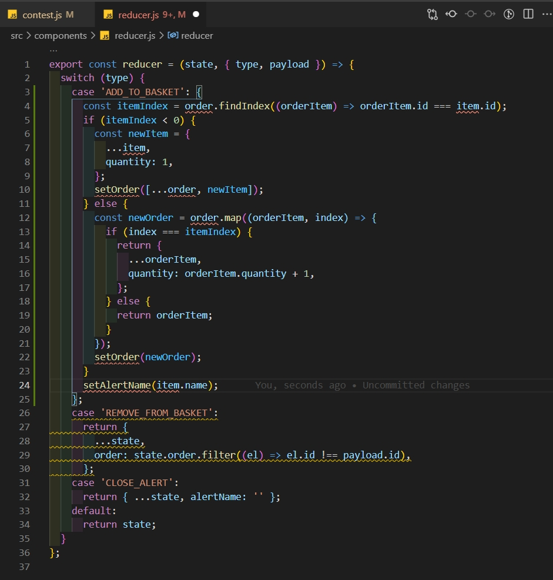

Исправляем.

Теперь к **order** я обращаюсь через состояние **state.order** т.к. теперь он храниться там.

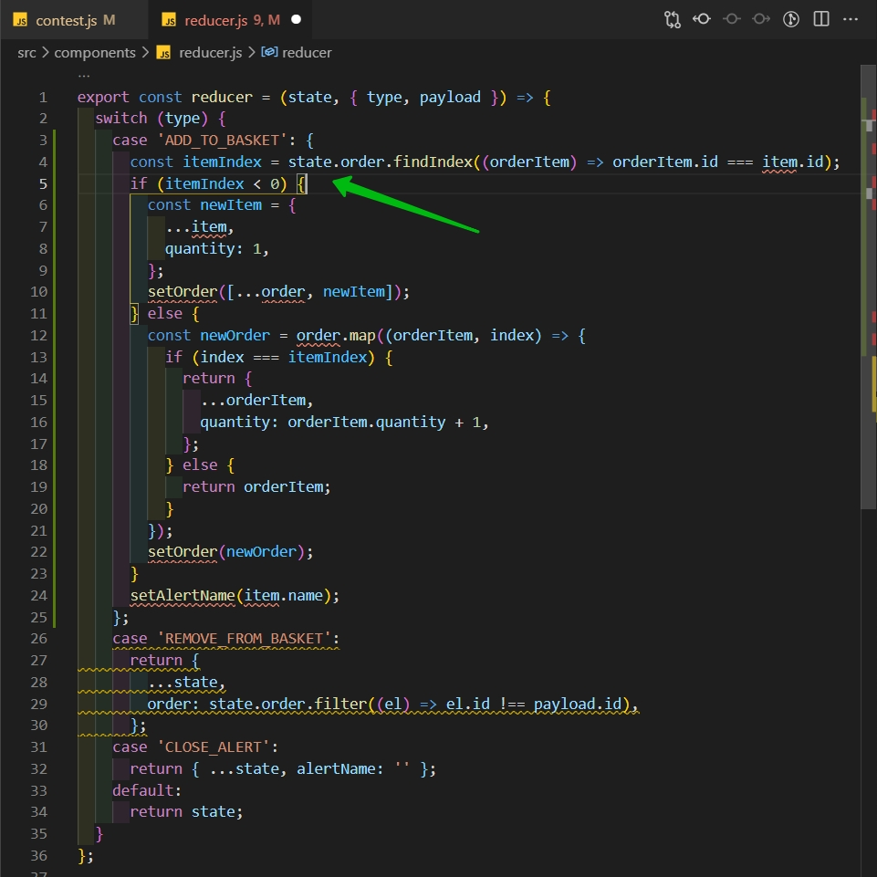

У меня нет **itemId**. Он хранится в **payload**.

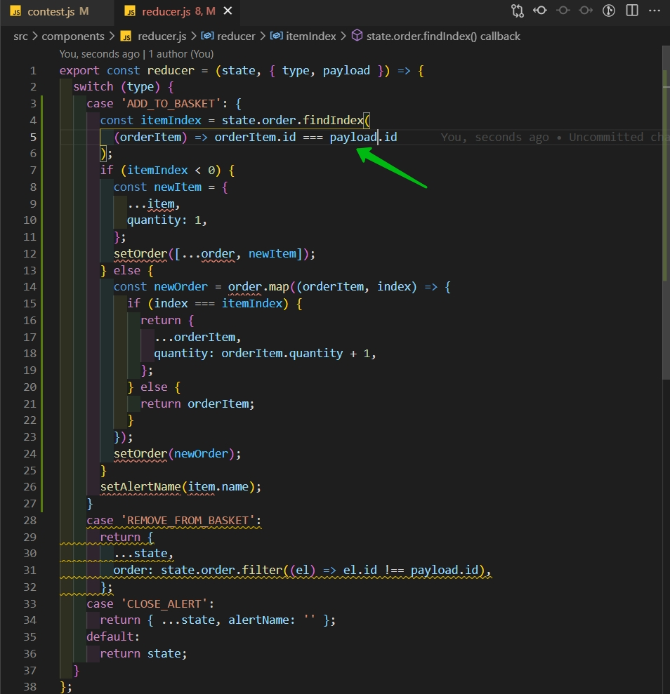

Мы делаем тоже самое. Мы ищем индекс полученный из вне. Новый это товар или старый. Если товар новый, то мы берем и весь наш **payload** спредим, создаем новый объект таким образом, и далее создаем ключ **quantity** со значением **1**.

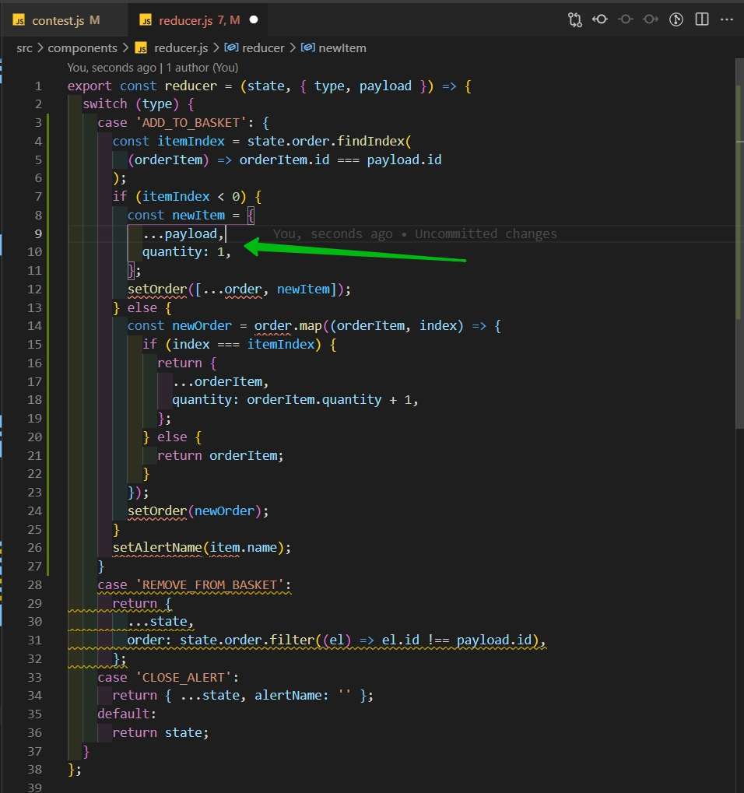

Вот эта часть **setOrder([...order, newItem]);** она от **useState**, она нам соответственно не нужна т.к. у нас функции **setOrder** попросту нет.

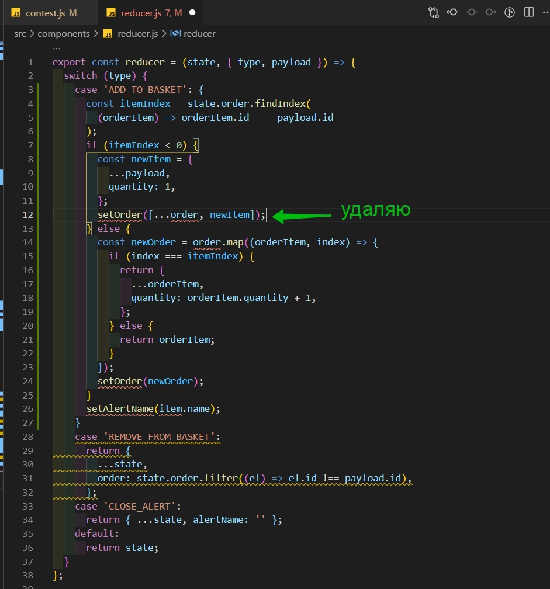

По сути мне нужно создать либо **newItem**, либо некую переменную как **newOrder**. Создаю переменную **newOrder** которая по умолчанию имеет значение **null**.

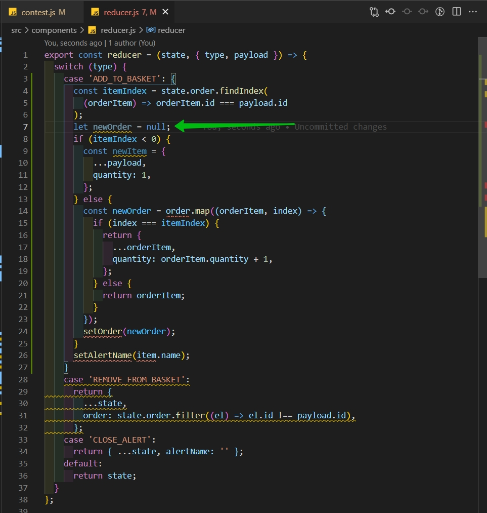

Соответственно в теле условия **if** переопределяю **newOrder** которой присваиваю старое значение **...state.order**, и вторым параметром указываю наш новый **item**, которые соответственно конкотенирует со старым значением.

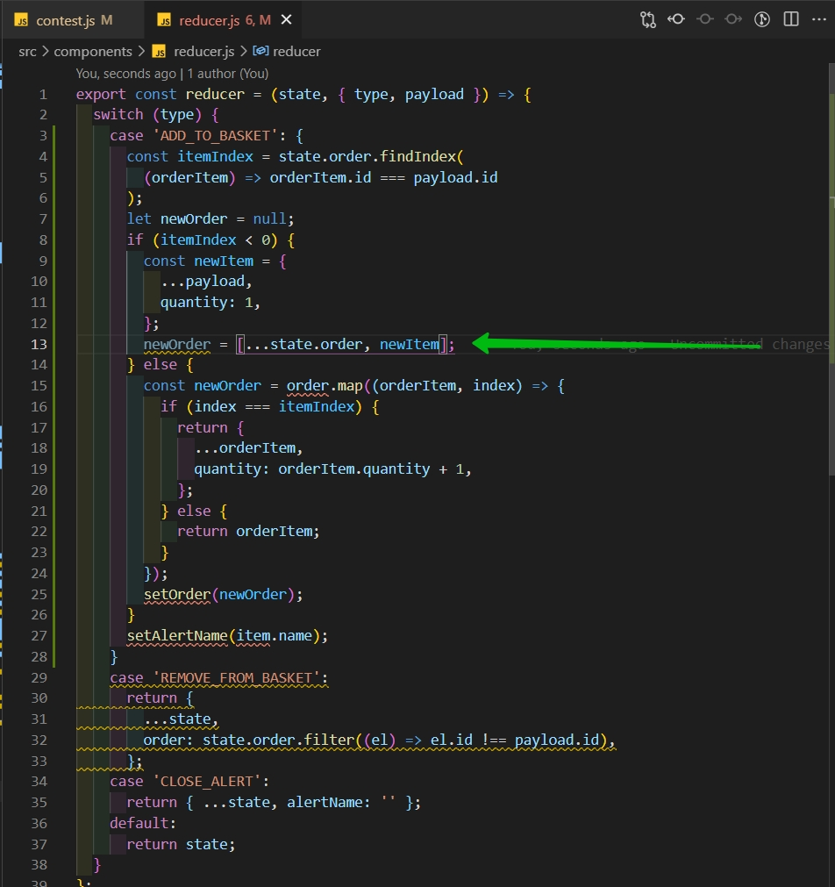

В else newOrder мы соответсвенно по другому его сформируем.

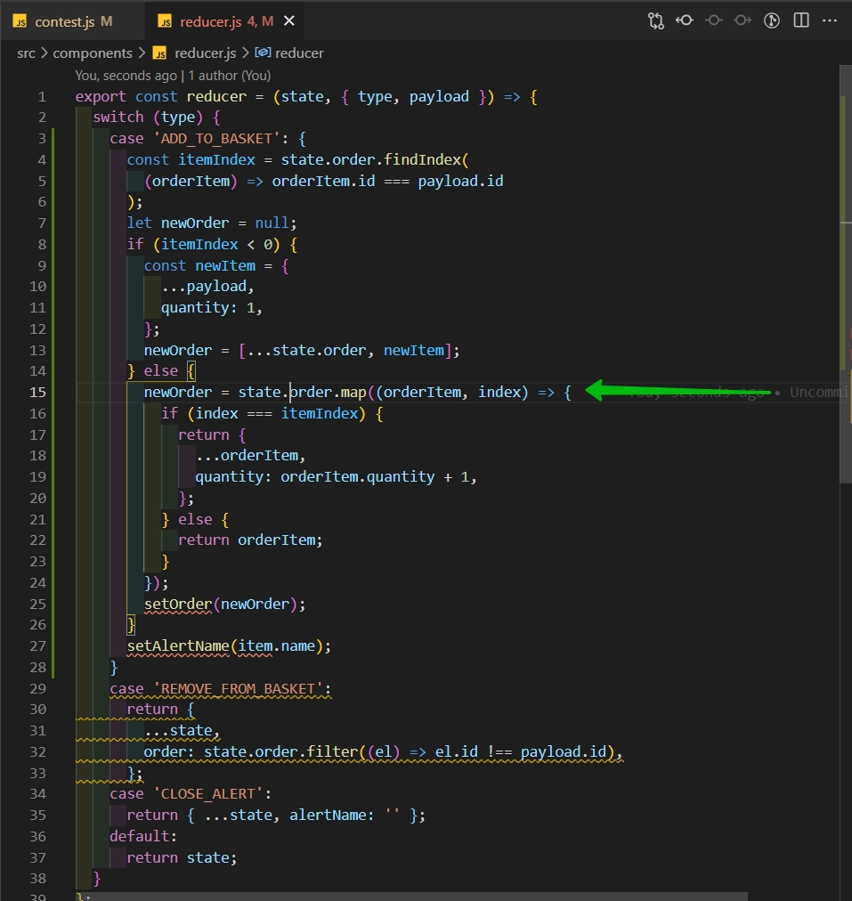

И далее мне нужно сделать следующую вещь.

Под **setAlertName** мне нужно сделать **return** который будет принимать весь текущий **state** **...state**, но будет менять наш **order:** на **newOrder**.

Кроме того мы здесь использовали **setAlertName**. У нас его больше нет. Но у нас есть просто **alertName**. Вместо двух функций обновления **state** мы используем все это дело в одном месте.

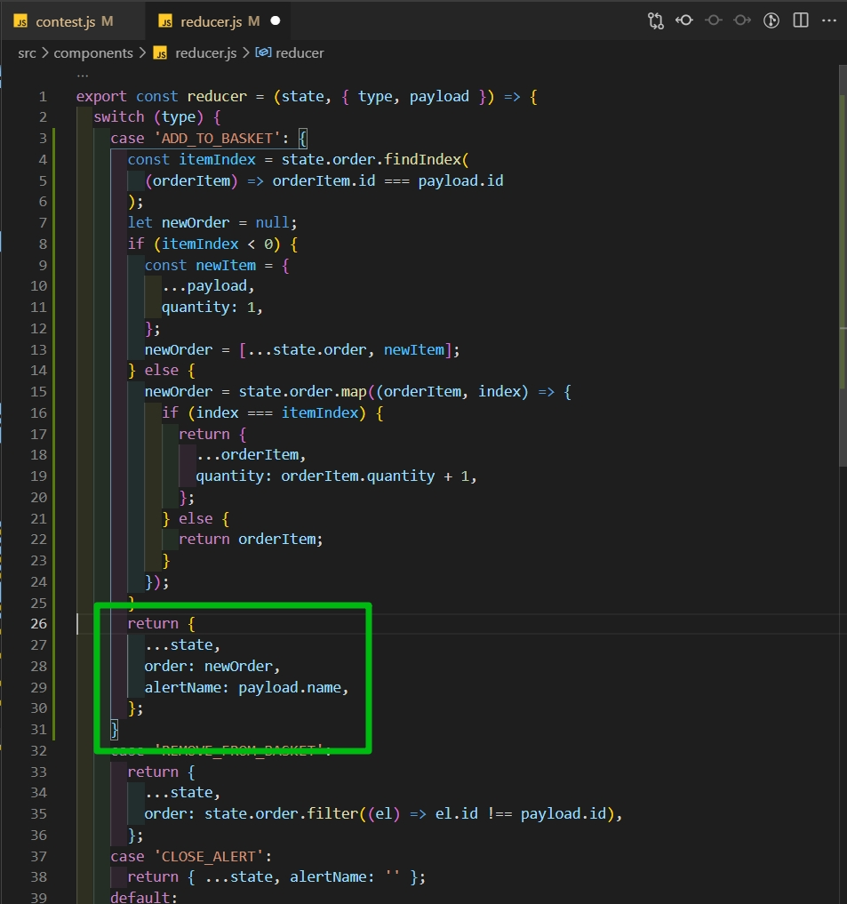

```js
export const reducer = (state, { type, payload }) => {
  switch (type) {
    case 'ADD_TO_BASKET': {
      const itemIndex = state.order.findIndex(
        (orderItem) => orderItem.id === payload.id
      );
      let newOrder = null;
      if (itemIndex < 0) {
        const newItem = {
          ...payload,
          quantity: 1,
        };
        newOrder = [...state.order, newItem];
      } else {
        newOrder = state.order.map((orderItem, index) => {
          if (index === itemIndex) {
            return {
              ...orderItem,
              quantity: orderItem.quantity + 1,
            };
          } else {
            return orderItem;
          }
        });
      }
      return {
        ...state,
        order: newOrder,
        alertName: payload.name,
      };
    }
    case 'REMOVE_FROM_BASKET':
      return {
        ...state,
        order: state.order.filter((el) => el.id !== payload.id),
      };
    case 'CLOSE_ALERT':
      return { ...state, alertName: '' };
    default:
      return state;
  }
};
```

И так **addToBasket** вроде как есть.

И так теперь функция увеличения количества.

Иду в контекст. Прописываю **value.incQuantity**. В эту функцию я принимаю некий **itemId**. В теле соответственно вызываю метод **dispatch**. Передаю **type:'INCREMENT_QUANTITY'**. И **payload** соотвтетственно равен **{id:itemId}**.

Все тоже самое соотвтетственно для **decrement**

```js
//context.js
import React, { createContext, useReducer } from 'react';
import { reducer } from './reducer.js';

export const ShopContext = createContext();

const initialState = {
  goods: [],
  loading: true,
  order: [],
  isBasketShow: false,
  alertName: '',
};

export const ContextProvider = ({ children }) => {
  const [value, dispatch] = useReducer(reducer, initialState);

  value.removeFromBasket = (itemId) => {
    dispatch({ type: 'REMOVE_FROM_BASKET', payload: { id: itemId } });
  };

  value.addToBasket = (item) => {
    dispatch({ type: 'ADD_TO_BASKET', payload: item });
  };

  value.incQuantity = (itemId) => {
    dispatch({ type: 'INCREMENT_QUANTITY', payload: { id: itemId } });
  };

  value.decQuantity = (itemId) => {
    dispatch({ type: 'DECREMENT_QUANTITY', payload: { id: itemId } });
  };

  value.closeAlert = () => {
    dispatch({ type: 'CLOSE_ALERT' });
  };

  return <ShopContext.Provider value={value}>{children}</ShopContext.Provider>;
};
```

Берем и добавляем их в reducer как соотвтетствущие **case**.

```js
export const reducer = (state, { type, payload }) => {
  switch (type) {
    case 'ADD_TO_BASKET': {
      const itemIndex = state.order.findIndex(
        (orderItem) => orderItem.id === payload.id
      );
      let newOrder = null;
      if (itemIndex < 0) {
        const newItem = {
          ...payload,
          quantity: 1,
        };
        newOrder = [...state.order, newItem];
      } else {
        newOrder = state.order.map((orderItem, index) => {
          if (index === itemIndex) {
            return {
              ...orderItem,
              quantity: orderItem.quantity + 1,
            };
          } else {
            return orderItem;
          }
        });
      }
      return {
        ...state,
        order: newOrder,
        alertName: payload.name,
      };
    }
    case 'REMOVE_FROM_BASKET':
      return {
        ...state,
        order: state.order.filter((el) => el.id !== payload.id),
      };
    case 'INCREMENT_QUANTITY':
      return { ...state };
    case 'DECREMENT_QUANTITY':
      return { ...state };
    case 'CLOSE_ALERT':
      return { ...state, alertName: '' };
    default:
      return state;
  }
};
```

И так говорим про инкремент.

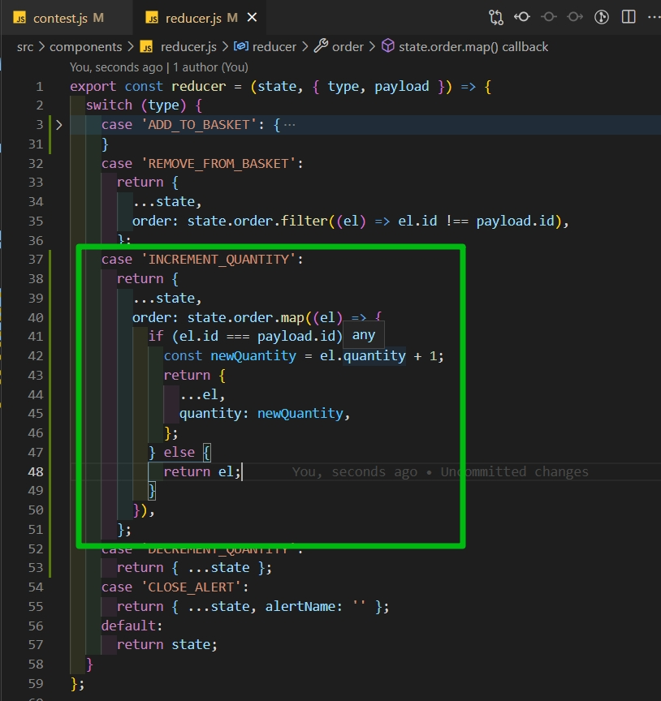

```js
export const reducer = (state, { type, payload }) => {
  switch (type) {
    case 'ADD_TO_BASKET': {
      const itemIndex = state.order.findIndex(
        (orderItem) => orderItem.id === payload.id
      );
      let newOrder = null;
      if (itemIndex < 0) {
        const newItem = {
          ...payload,
          quantity: 1,
        };
        newOrder = [...state.order, newItem];
      } else {
        newOrder = state.order.map((orderItem, index) => {
          if (index === itemIndex) {
            return {
              ...orderItem,
              quantity: orderItem.quantity + 1,
            };
          } else {
            return orderItem;
          }
        });
      }
      return {
        ...state,
        order: newOrder,
        alertName: payload.name,
      };
    }
    case 'REMOVE_FROM_BASKET':
      return {
        ...state,
        order: state.order.filter((el) => el.id !== payload.id),
      };
    case 'INCREMENT_QUANTITY':
      return {
        ...state,
        order: state.order.map((el) => {
          if (el.id === payload.id) {
            const newQuantity = el.quantity + 1;
            return {
              ...el,
              quantity: newQuantity,
            };
          } else {
            return el;
          }
        }),
      };
    case 'DECREMENT_QUANTITY':
      return { ...state };
    case 'CLOSE_ALERT':
      return { ...state, alertName: '' };
    default:
      return state;
  }
};
```

Для декремента.

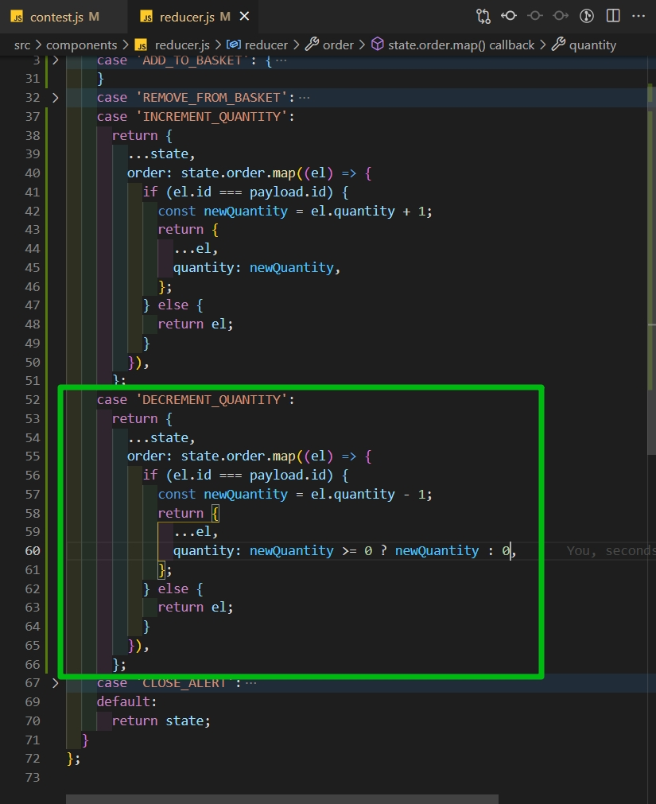

```js
export const reducer = (state, { type, payload }) => {
  switch (type) {
    case 'ADD_TO_BASKET': {
      const itemIndex = state.order.findIndex(
        (orderItem) => orderItem.id === payload.id
      );
      let newOrder = null;
      if (itemIndex < 0) {
        const newItem = {
          ...payload,
          quantity: 1,
        };
        newOrder = [...state.order, newItem];
      } else {
        newOrder = state.order.map((orderItem, index) => {
          if (index === itemIndex) {
            return {
              ...orderItem,
              quantity: orderItem.quantity + 1,
            };
          } else {
            return orderItem;
          }
        });
      }
      return {
        ...state,
        order: newOrder,
        alertName: payload.name,
      };
    }
    case 'REMOVE_FROM_BASKET':
      return {
        ...state,
        order: state.order.filter((el) => el.id !== payload.id),
      };
    case 'INCREMENT_QUANTITY':
      return {
        ...state,
        order: state.order.map((el) => {
          if (el.id === payload.id) {
            const newQuantity = el.quantity + 1;
            return {
              ...el,
              quantity: newQuantity,
            };
          } else {
            return el;
          }
        }),
      };
    case 'DECREMENT_QUANTITY':
      return {
        ...state,
        order: state.order.map((el) => {
          if (el.id === payload.id) {
            const newQuantity = el.quantity - 1;
            return {
              ...el,
              quantity: newQuantity >= 0 ? newQuantity : 0,
            };
          } else {
            return el;
          }
        }),
      };
    case 'CLOSE_ALERT':
      return { ...state, alertName: '' };
    default:
      return state;
  }
};
```

И мне осталась только ода функция **handleBasketShow**. Это просто Булево значение. И типом будет **TOGGLE_BASKET** т.е. **вкл/выкл**.

```js
//context.js
import React, { createContext, useReducer } from 'react';
import { reducer } from './reducer.js';

export const ShopContext = createContext();

const initialState = {
  goods: [],
  loading: true,
  order: [],
  isBasketShow: false,
  alertName: '',
};

export const ContextProvider = ({ children }) => {
  const [value, dispatch] = useReducer(reducer, initialState);

  value.removeFromBasket = (itemId) => {
    dispatch({ type: 'REMOVE_FROM_BASKET', payload: { id: itemId } });
  };

  value.addToBasket = (item) => {
    dispatch({ type: 'ADD_TO_BASKET', payload: item });
  };

  value.incQuantity = (itemId) => {
    dispatch({ type: 'INCREMENT_QUANTITY', payload: { id: itemId } });
  };

  value.decQuantity = (itemId) => {
    dispatch({ type: 'DECREMENT_QUANTITY', payload: { id: itemId } });
  };

  value.closeAlert = () => {
    dispatch({ type: 'CLOSE_ALERT' });
  };

  value.handleBasketShow = () => {
    dispatch({ type: 'TOGGLE_BASKET' });
  };

  return <ShopContext.Provider value={value}>{children}</ShopContext.Provider>;
};
```

```js
export const reducer = (state, { type, payload }) => {
  switch (type) {
    case 'ADD_TO_BASKET': {
      const itemIndex = state.order.findIndex(
        (orderItem) => orderItem.id === payload.id
      );
      let newOrder = null;
      if (itemIndex < 0) {
        const newItem = {
          ...payload,
          quantity: 1,
        };
        newOrder = [...state.order, newItem];
      } else {
        newOrder = state.order.map((orderItem, index) => {
          if (index === itemIndex) {
            return {
              ...orderItem,
              quantity: orderItem.quantity + 1,
            };
          } else {
            return orderItem;
          }
        });
      }
      return {
        ...state,
        order: newOrder,
        alertName: payload.name,
      };
    }
    case 'REMOVE_FROM_BASKET':
      return {
        ...state,
        order: state.order.filter((el) => el.id !== payload.id),
      };
    case 'INCREMENT_QUANTITY':
      return {
        ...state,
        order: state.order.map((el) => {
          if (el.id === payload.id) {
            const newQuantity = el.quantity + 1;
            return {
              ...el,
              quantity: newQuantity,
            };
          } else {
            return el;
          }
        }),
      };
    case 'DECREMENT_QUANTITY':
      return {
        ...state,
        order: state.order.map((el) => {
          if (el.id === payload.id) {
            const newQuantity = el.quantity - 1;
            return {
              ...el,
              quantity: newQuantity >= 0 ? newQuantity : 0,
            };
          } else {
            return el;
          }
        }),
      };
    case 'CLOSE_ALERT':
      return { ...state, alertName: '' };
    case 'TOGGLE_BASKET':
      return { ...state, isBasketShow: !state.isBasketShow };
    default:
      return state;
  }
};
```

По сути **reducer** у нас готов.

Сейчас логика нашего приложения храниться в одном месте. А все остальные места у нас превращаются в представление. И мы разделили представление и логику. Нужные нам данные. Нужные нам функции мы теперь через контекст сможем доставать где нам будет необходимо. Потому что наш **value** содержит и все данные

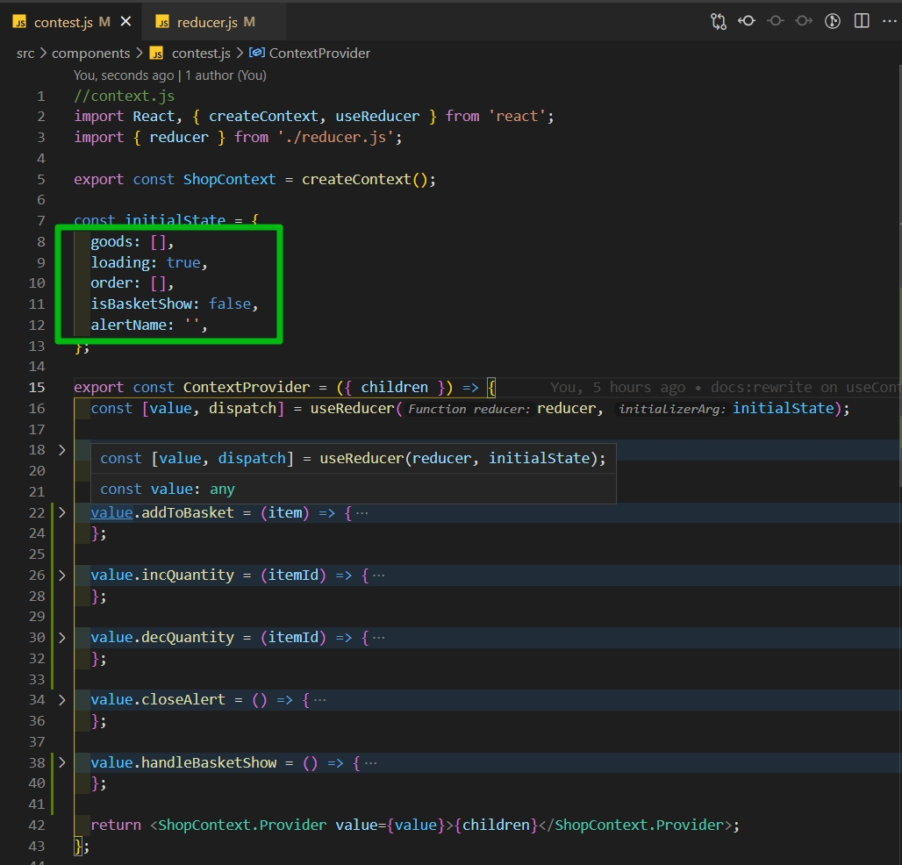

Изначальные, и обновленные тоже. Потому что благодаря хуку и нашему редюсеру они будут обновляться все.
