# Обзор API, что доступно, как использовать

Рассмотрим **API** с сайта <https://fortniteapi.io/>. В первую очередь нужно зарегистрироваться для того что бы получить уникальный ключ.

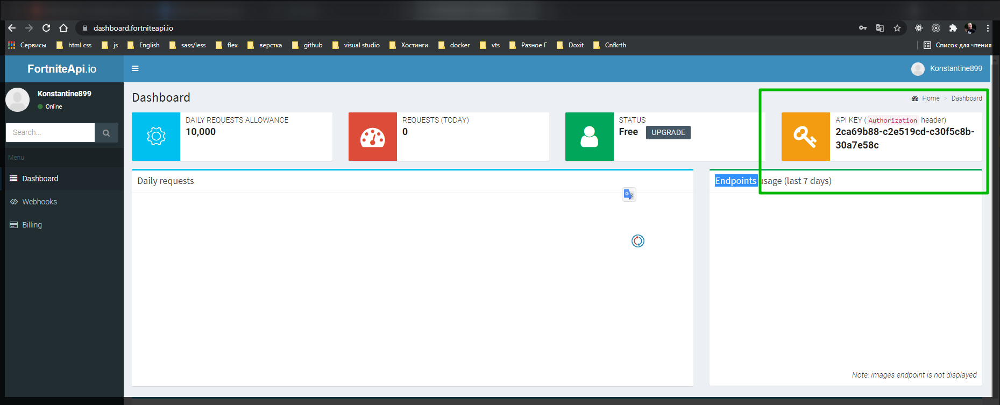

Используя данную базу можно сделать очень много проектов. Настоятельно рекомендую.

В данном **API** передача ключа отличается. Если раньше мы вставляли ключ прямо в ссылку через **get** параметр, то здесь у нас требуют его передавать через некий заголовок

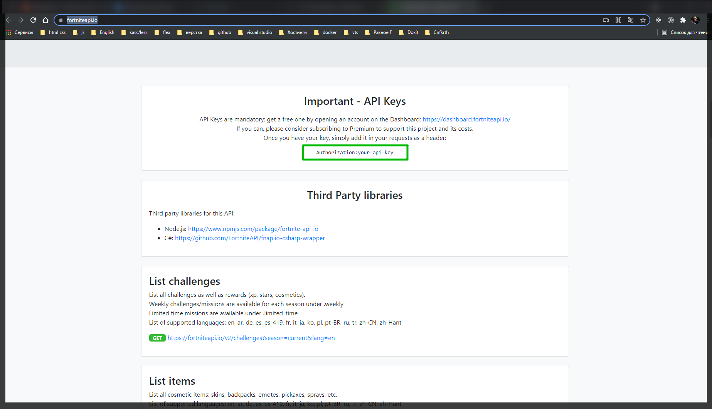

В то же самое время нам показано что мы можем отсюда получить. Мы можем получить список соревнований. Список каких-то **item**.

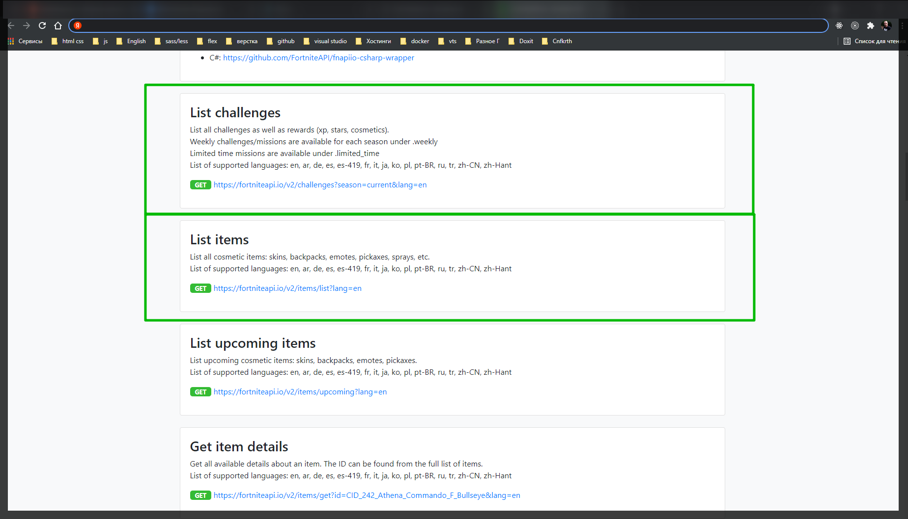

Под **item** могут быть различные вещи.

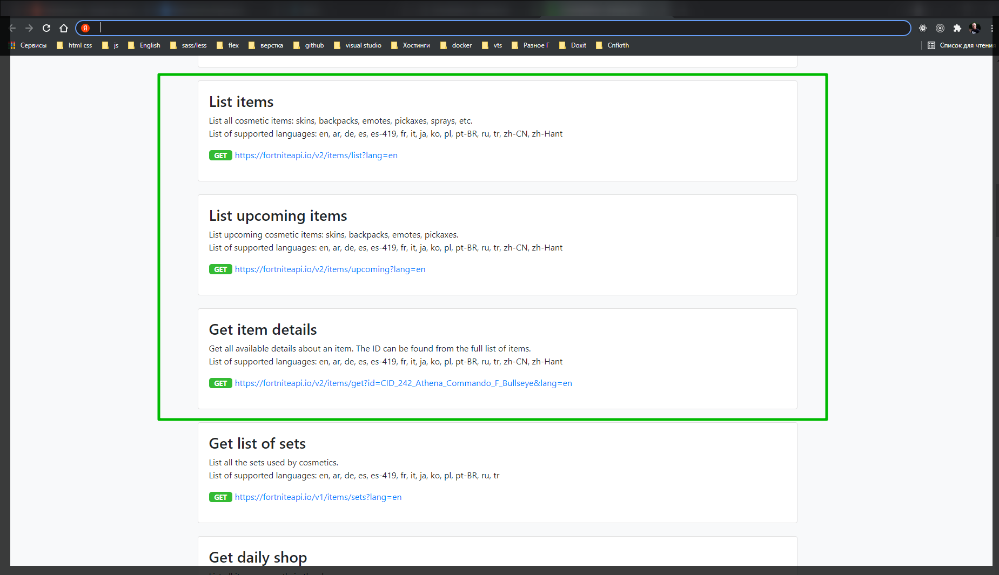

У каждого **item** есть подробности. Соответственно по ID мы можем запросить эти подробности. Можно создавать самые разные приложения создвать на основе этого API. Причем они постоянно обновляют свой контент.

Другой нюанс это то что здесь мы можем использовать самые разные языки. Т.е. в один момент в **get** параметре мы можем указать на каком языке нам должны прилетать данные. Даже на русском.

И так посмотрим через **POSTMAN** как я с этим буду работать.

Создаю новый запрос

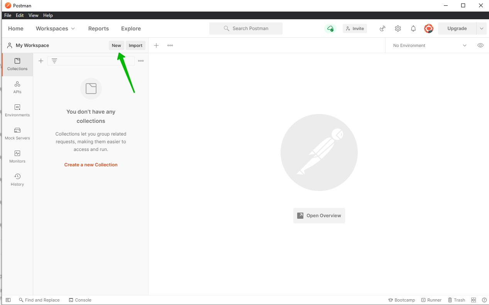

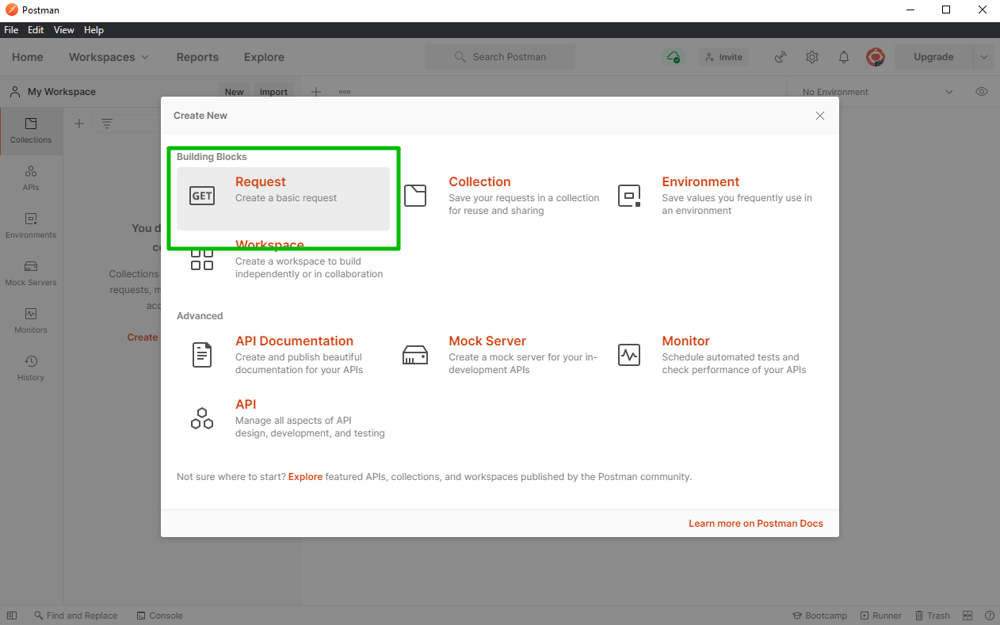

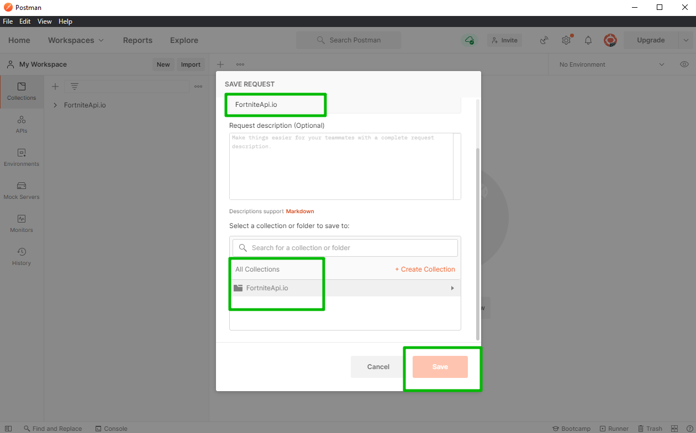

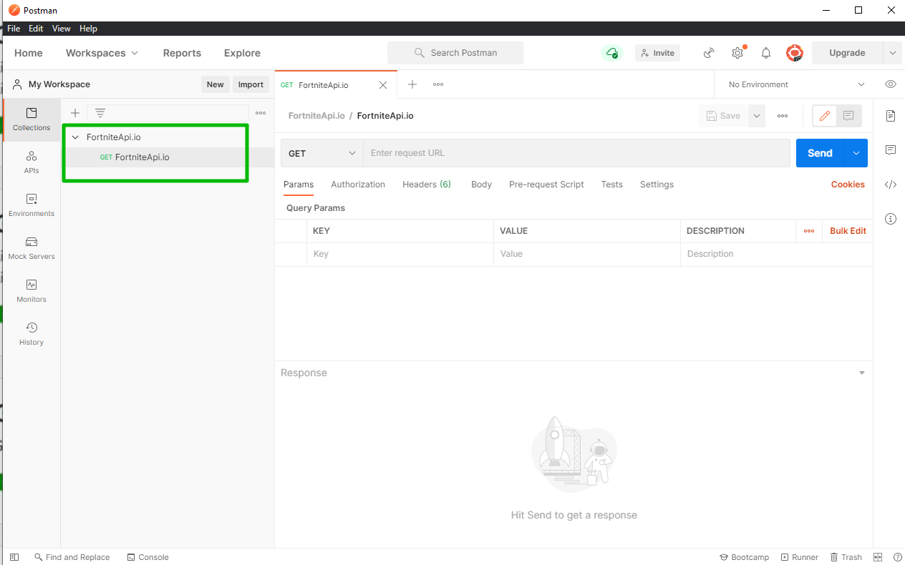

И соответственно попробую что-то запросить.

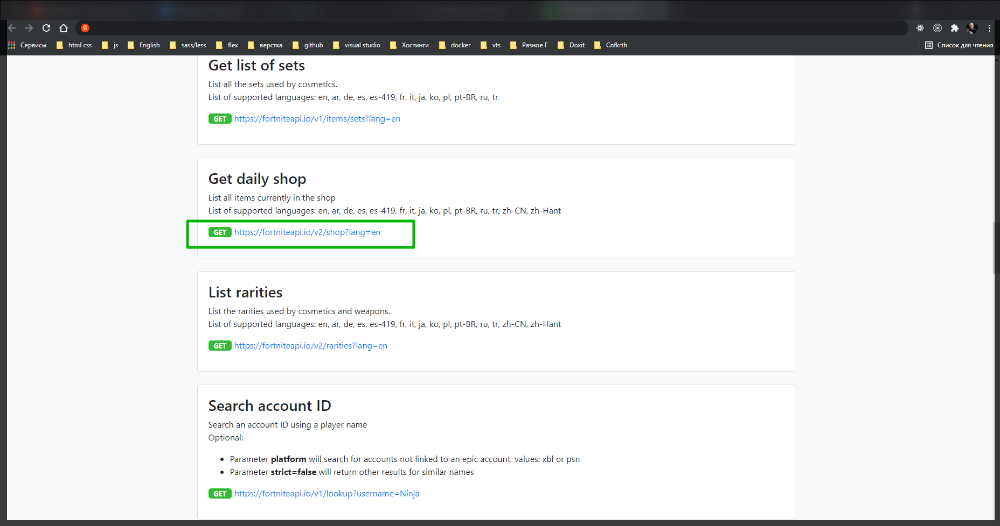

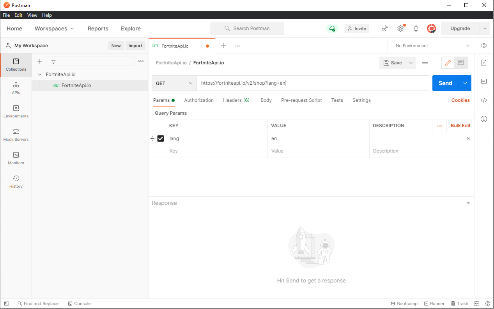

И теперь, как было сказано выше в данном **API** нужно отправить заголовок. В **POSTMAN** перехожу во вкладку **Headers**. На сайте смотрю какой именно заголовок от нас хотят. Он называется **Authorization**.

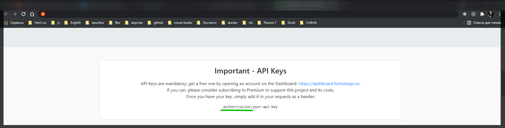

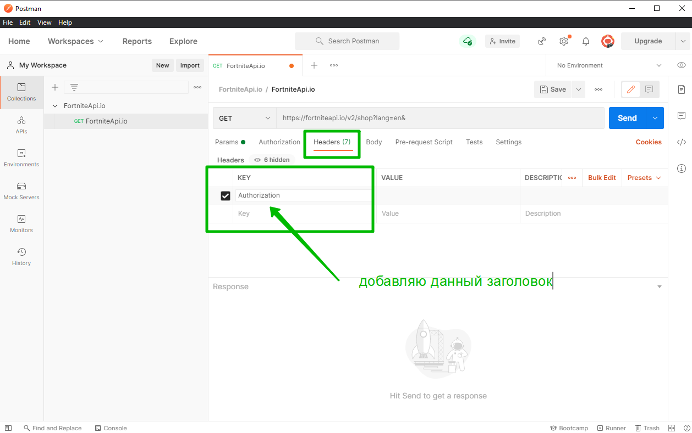

И далее после заголовка вставляю наш уникальный ключ. Что бы посмотреть свой ключ перехожу на сайте во вкладку **Dashbord**

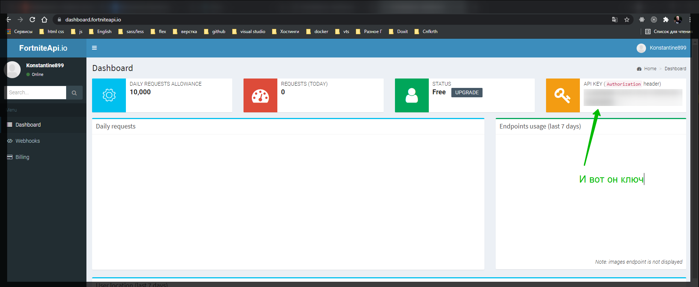

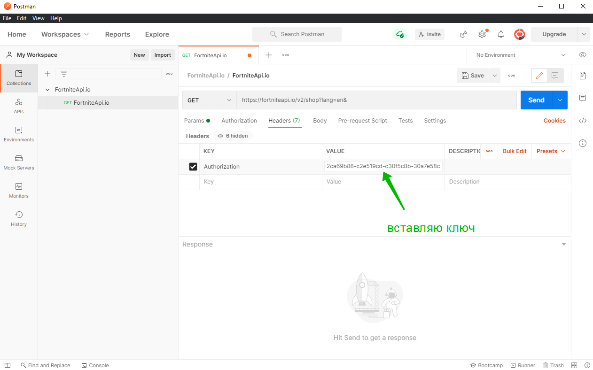

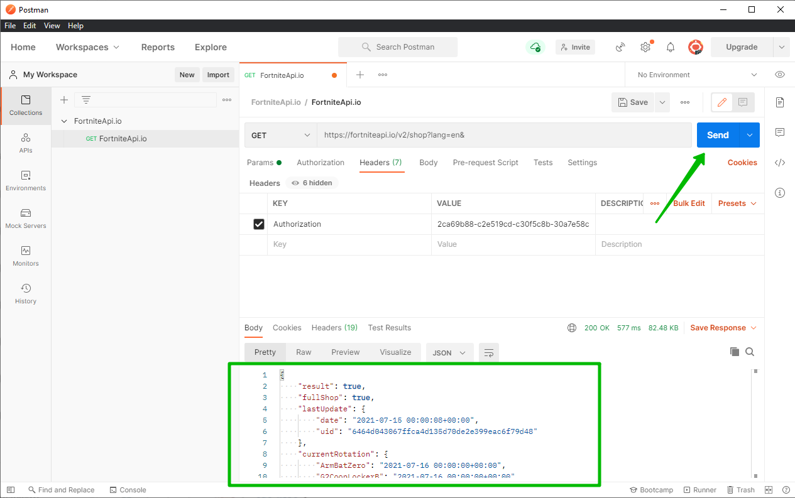

И если я все сделал правильно я получаю запрашиваемые данные.
