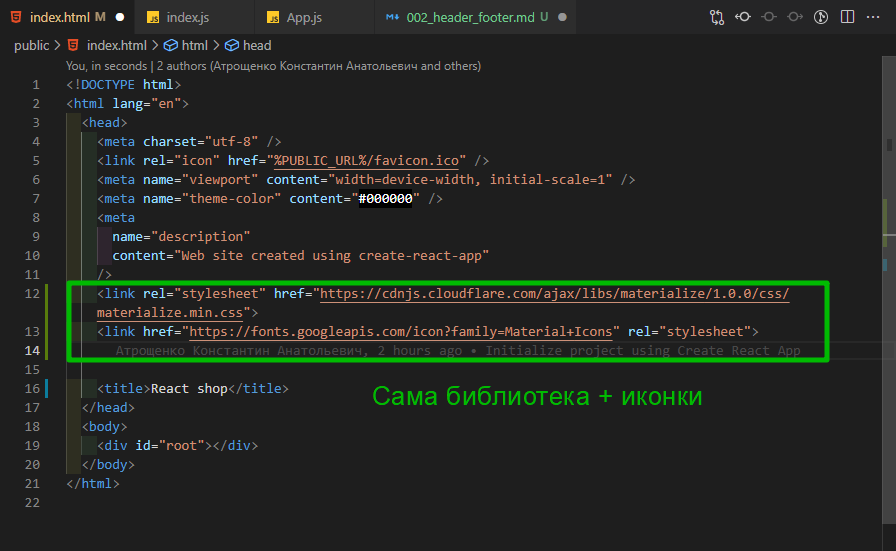
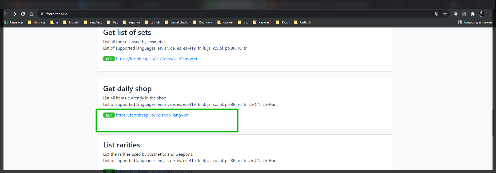
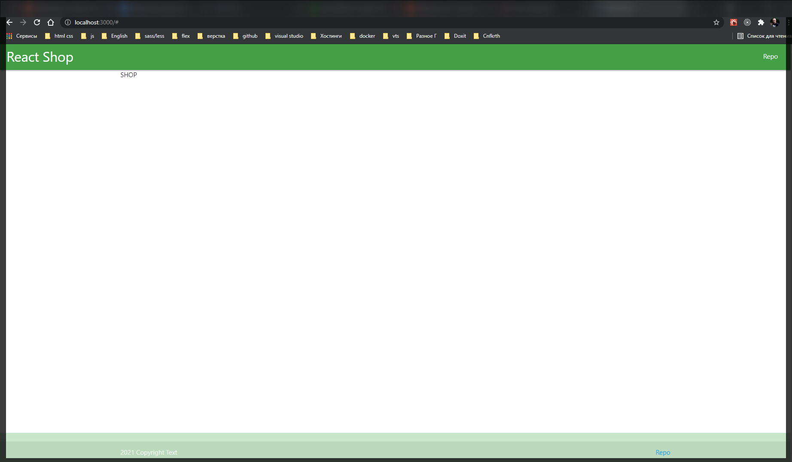

# Подготовка проекта, шапка и футер

Сразу подключаю библиотеку <https://materializecss.com>. Подключаю ее через **CDN**.



```html
<!DOCTYPE html>
<html lang="en">
  <head>
    <meta charset="utf-8" />
    <link rel="icon" href="%PUBLIC_URL%/favicon.ico" />
    <meta name="viewport" content="width=device-width, initial-scale=1" />
    <meta name="theme-color" content="#000000" />
    <meta
      name="description"
      content="Web site created using create-react-app"
    />
    <link
      rel="stylesheet"
      href="https://cdnjs.cloudflare.com/ajax/libs/materialize/1.0.0/css/materialize.min.css"
    />
    <link
      href="https://fonts.googleapis.com/icon?family=Material+Icons"
      rel="stylesheet"
    />

    <title>React shop</title>
  </head>
  <body>
    <div id="root"></div>
  </body>
</html>
```

Далее в src создаю папку components в ней компонент **Header.jsx** и **Footer.jsx**.

И в **index.css** добавляю стили.

```css
body {
  margin: 0;
  font-family: -apple-system, BlinkMacSystemFont, 'Segoe UI', 'Roboto',
    'Oxygen', 'Ubuntu', 'Cantarell', 'Fira Sans', 'Droid Sans',
    'Helvetica Neue', sans-serif;
  -webkit-font-smoothing: antialiased;
  -moz-osx-font-smoothing: grayscale;
}

code {
  font-family: source-code-pro, Menlo, Monaco, Consolas, 'Courier New',
    monospace;
}

nav {
  padding: 0 1rem;
}
.content {
  min-height: calc(100vh - 70px - 60px);
}
.goods {
  display: grid;
  grid-template-columns: repeat(auto-fill, minmax(250, 1fr));
  padding: 1.5rem;
}
```

И так же создаю файл **.env.local** Файлик с локальными переменными. В данный файл будет входить ключ который я получил при регистрации

```
REACT_APP_API_KEY=2ca69b88-c2e519cd-c30f5c8b-30a7e58c
```

Далее создаю файл confin.js. В нем я как раз буду получать наш ключ из переменной **process.env**

```js
//config.js
const API_KEY = process.env.REACT_APP_API_KEY;
```

И здесь у меня будет наша ссылка.



```js
//config.js
const API_KEY = process.env.REACT_APP_API_KEY;
const API_URL = `https://fortniteapi.io/v2/shop?lang=ru`;

export { API_KEY, API_URL };
```

И далее импортирую созданные компоненты в **App.js**

```jsx
import React from 'react';
import { Header } from './components/Header.jsx';
import { Footer } from './components//Footer.jsx';

function App() {
  return (
    <>
      <Header />
      <Footer />
    </>
  );
}

export default App;
```

Далее создаю компонент **Shop** который возвращает **className container content**.

```jsx
import React from 'react';

export const Shop = () => {
  return <main className="container content"></main>;
};
```

```jsx
import React from 'react';
import { Header } from './components/Header.jsx';
import { Footer } from './components//Footer.jsx';
import { Shop } from './components/Shop.jsx';

function App() {
  return (
    <>
      <Header />
      <Shop />
      <Footer />
    </>
  );
}

export default App;
```

И так же добавляю базовую разметку

```jsx
import React from 'react';

export const Header = () => {
  return (
    <nav className="green darken-1">
      <div className="nav-wrapper">
        <a href="#" className="brand-logo">
          React Shop
        </a>
        <ul className="right hide-on-med-and-down">
          <li>
            <a href="!#">Repo</a>
          </li>
        </ul>
      </div>
    </nav>
  );
};
```

```jsx
import React from 'react';

export const Footer = () => {
  return (
    <footer className="page-footer green  lighten-4">
      <div className="footer-copyright">
        <div className="container">
          {new Date().getFullYear()} Copyright Text
          <a href="#!" className="gray-text text-lighten-4 right">
            Repo
          </a>
        </div>
      </div>
    </footer>
  );
};
```


